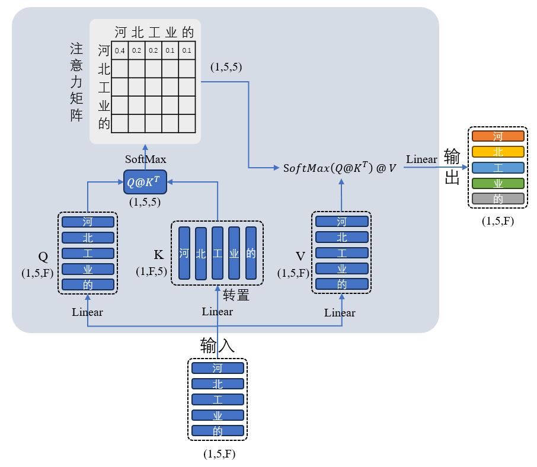

# Attention mechanism in Transformer

* Multi-head attention (MHA), see [paper](https://proceedings.neurips.cc/paper/2017/file/3f5ee243547dee91fbd053c1c4a845aa-Paper.pdf).
  * What is Self-attention

* grouped-query attention (GQA), see [paper](https://arxiv.org/pdf/2305.13245).
* Multi-Head Latent Attention (MLA), see [paper](https://arxiv.org/pdf/2405.04434?#page=5.38).
* Linear attention, see [paper](https://proceedings.mlr.press/v119/katharopoulos20a/katharopoulos20a.pdf).
* flash attention, see [paper](https://proceedings.neurips.cc/paper_files/paper/2022/file/67d57c32e20fd0a7a302cb81d36e40d5-Paper-Conference.pdf).
