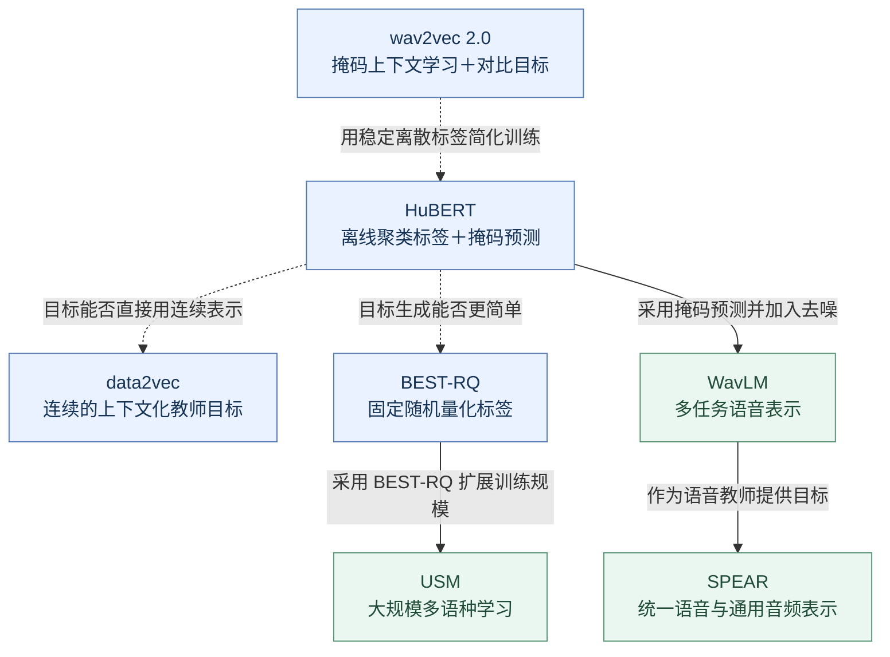
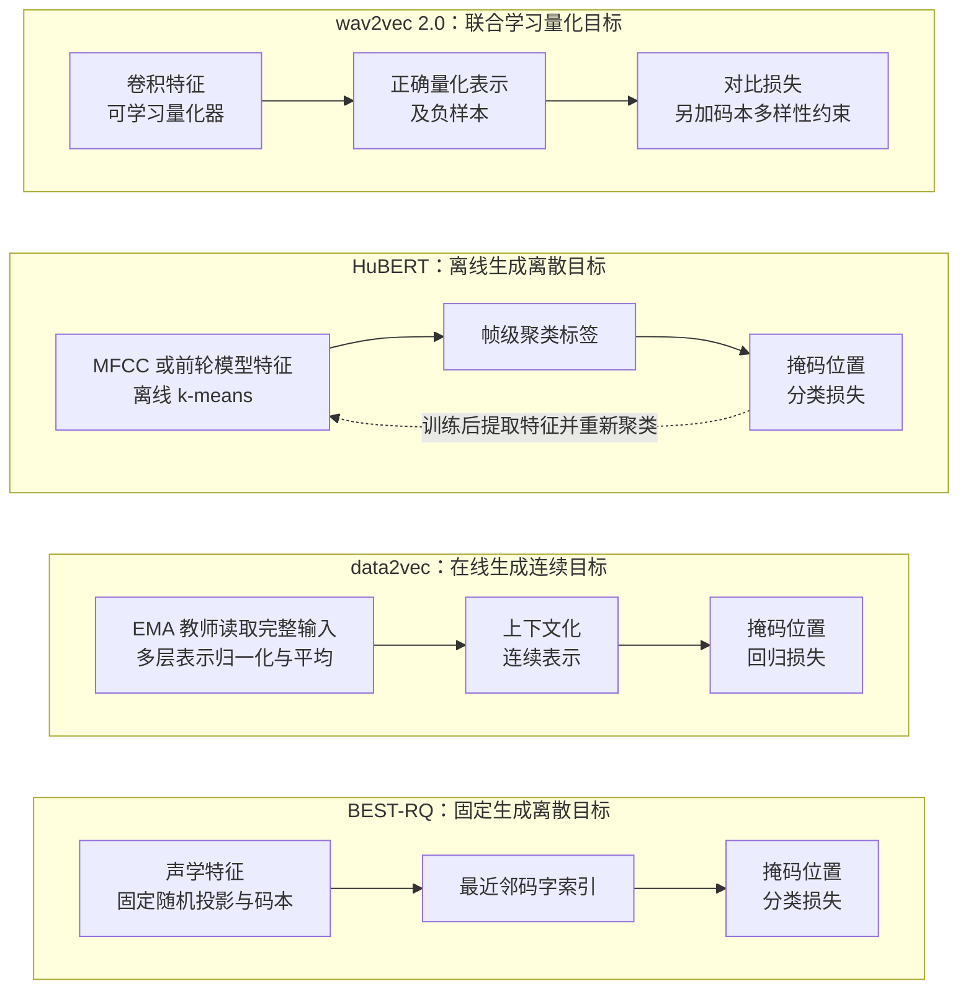
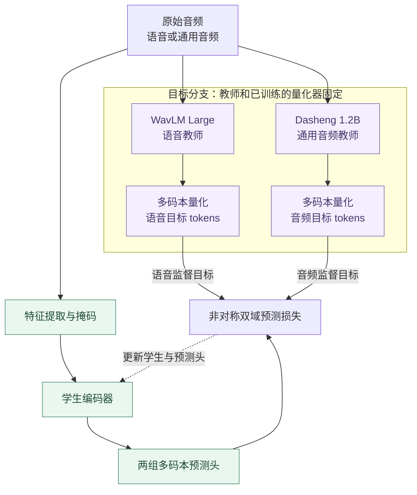

# 语音自监督学习进展报告：从掩码预测到通用语音表示

整理日期：2026 年 10 月 5 日。

本文围绕七篇代表性工作展开：**wav2vec 2.0、HuBERT、data2vec、BEST-RQ、WavLM、USM 和 SPEAR**。它们并非一条严格的模型继承链，但可以串成两条紧密相连的主线：**如何构造有效的自监督目标，以及如何让学到的表示支持更多语言和任务。** 文末补充近期预印本作为前沿观察，不作全面文献罗列。

TODO

1、用一个表格描述自监督代理任务和损失函数的作用。

2、用一个表格描述出不同方法之间的区别和联系，用完形填空这个形象的例子展开，表达清楚各个代表性方法的代理任务和损失函数。

## 一、核心脉络：先解决“预测什么”，再解决“表示能用到哪里”

语音自监督学习（Speech SSL）的基本做法是：先用无转写音频构造训练目标、预训练编码器，再用少量标注适配语音识别等下游任务。这里的“自监督”描述的是预训练阶段；最终识别系统通常仍需要标注、解码器，部分结果还依赖外部语言模型。

语音与文本的差别在于，它没有天然给定的词元和边界。模型既要从连续信号中发现结构，又要决定哪些信息值得保留。因此，这一领域的重要变化，往往发生在**预测目标的来源、粒度和信息含量**上。

| 代表工作                                                      | 年份                   | 自监督目标或关键设计                   | 推动的问题                                |
| ------------------------------------------------------------- | ---------------------- | -------------------------------------- | ----------------------------------------- |
| [wav2vec 2.0](https://arxiv.org/abs/2006.11477)                | 2020                   | 在掩码位置辨别正确的量化表示与负样本   | 无转写预训练能否显著降低 ASR 的标注需求？ |
| [HuBERT](https://arxiv.org/abs/2106.07447)                     | 2021                   | 预测离线聚类标签，迭代改进标签         | 能否用稳定的离散目标替代复杂的对比训练？  |
| [data2vec](https://proceedings.mlr.press/v162/baevski22a.html) | 2022                   | 回归 EMA 教师的上下文化连续表示        | 离散语音单元是否是必要条件？              |
| [BEST-RQ](https://arxiv.org/abs/2202.01855)                    | 2022                   | 预测固定随机投影量化器产生的标签       | 目标生成能否进一步简化并方便扩展？        |
| [WavLM](https://arxiv.org/abs/2110.13900)                      | 2021 预印本／2022 期刊 | 掩码预测结合去噪，增加数据多样性       | 能否同时服务内容、说话人及其他语音任务？  |
| [Google USM](https://arxiv.org/abs/2303.01037)                 | 2023                   | 将 BEST-RQ 扩展至大规模多语种预训练    | 简单目标能否支撑数百种语言的数据规模？    |
| [SPEAR](https://proceedings.mlr.press/v306/yang26cv.html)      | 2025 预印本／2026 ICML | 预测语音和通用音频教师的多码本离散目标 | 能否把互补的声音知识整合到一个编码器？    |

这张表不是性能排名。各论文的数据规模、模型容量、微调标注量和评测协议不同，不能将其最佳分数直接排列后归因于训练目标。

**图 1：关键论文之间的问题承接。** 虚线表示本文归纳的研究问题关联，实线表示后续工作对相应方法或模型的具体使用；位置不代表严格的发表顺序。

## 二、第一条主线：掩码预测目标的演进

**图 2：四种方法到底让模型“预测什么”。** 图中只展开目标生成与损失，省略共同的掩码输入和上下文编码过程；训练目标来自未遮挡的音频或特征。

### 1. wav2vec 2.0：建立“无标注预训练＋少量标注微调”的有力基线

wav2vec 2.0 用卷积网络把波形变为连续特征，在特征序列上遮住若干时间片段，再由 Transformer 利用上下文辨别该位置正确的量化表示。量化模块与编码器联合学习，训练还通过码本多样性约束鼓励使用不同码字。其关键不是复原每个波形采样点，而是学习能预测语音结构的表示。[原论文](https://arxiv.org/abs/2006.11477)

最有代表性的结果是：约 **5.3 万小时无标注音频预训练、10 分钟标注微调，并使用 Transformer 语言模型解码**，在 LibriSpeech test-clean／test-other 上得到 **4.8%／8.2% WER**。这个结果证明了降低人工转写需求的潜力，但也意味着大量无标注数据和额外文本资源参与了系统构建。[论文实验表](https://arxiv.org/html/2006.11477v3)

它给后续工作留下的核心问题是：既然上下文预测有效，是否必须同时学习量化器、选择负样本并优化对比目标？

### 2. HuBERT：把问题转化为“预测稳定的隐藏单元”

HuBERT 保留掩码预测，但先离线生成帧级标签：初始阶段聚类 MFCC，后续阶段聚类前一轮模型的中间层表示。编码器接收连续语音输入，预测遮住位置的聚类类别，从而形成“聚类生成目标—训练表示—重新聚类”的循环。在多个标注量设置下，论文取得了与 wav2vec 2.0 相当或更好的识别结果。[原论文](https://arxiv.org/abs/2106.07447)

它的重要发现是：**目标的一致性可以比初始标签的准确性更重要。** 聚类类别无需一开始就对应真实音素；只要规律稳定，模型就能通过上下文学习超出初始特征的结构。离散目标是训练信号，不等于人工定义的语言单位。不过，离线特征提取、聚类和迭代训练也带来了流程成本。[方法与分析](https://arxiv.org/html/2106.07447v1)

作为两者之间的补充，[w2v-BERT（2021）](https://arxiv.org/abs/2108.06209)同时优化对比学习与掩码单元预测，让离散单元发现和上下文建模端到端完成。它说明“怎样生成目标”和“怎样预测目标”可以联合设计；报告后续重点放在更鲜明的两种选择上。

### 3. data2vec：直接预测教师表示，不再要求离散标签

data2vec 让教师读取完整输入、学生读取掩码输入。教师参数是学生参数的指数移动平均（EMA），训练目标由教师多个高层的表示经归一化、平均形成。学生回归这些连续目标，因此无需离线聚类、离散码本或负样本。[原论文](https://proceedings.mlr.press/v162/baevski22a.html)

相较 HuBERT，这一步把目标从“该帧属于哪类单元”变为“结合完整上下文，该位置应得到什么表示”。论文的消融支持上下文化目标和多层聚合的作用。它在语音、视觉和文本上采用统一的学习原则，但原始工作分别训练各模态模型，不能据此认定已经获得一个跨模态共享模型。[方法与消融](https://arxiv.org/html/2202.03555v3)

对这条路线的理解是：教师不仅负责给答案，也规定学生需要保留的信息；目标生成逐渐成为表示学习本身的一部分。

### 4. BEST-RQ：有效目标甚至可以来自固定随机量化器

BEST-RQ 采取另一种简化：将声学特征通过固定随机矩阵投影，再在固定随机码本中寻找最近邻，以其索引作为掩码预测标签。投影矩阵和码本均不随预训练更新。论文在非流式、流式及多语种识别设置中验证了这种做法的有效性，并强调它与不同识别架构的兼容性。[原论文](https://arxiv.org/abs/2202.01855)

这一结果修正了一个直觉：**好的预训练表示不一定要求预训练标签本身具有清晰的音素含义。** 随机目标仍由音频确定，预测它需要利用声学和时间结构；“随机”不意味着每次任意更换标签。这里的结论也有边界：BEST-RQ 的主要证据来自 ASR，不能自动推广为所有语音任务上的最优选择。

将这四篇论文连起来，研究问题便很清楚：wav2vec 2.0 证明掩码上下文学习有效；HuBERT 用稳定离散标签简化目标；data2vec 用教师连续表示提高目标的信息含量；BEST-RQ 则表明，简化目标生成也能获得强表示。**目标越复杂越好，并不是这些论文共同支持的结论。**

## 三、第二条主线：从识别预训练走向更通用的语音表示

### 1. WavLM：语音表示需要保留“谁在说、怎样说”

早期工作的突出成果集中在识别，但语音信号还包含说话人、情绪、韵律以及声源关系。WavLM 在 HuBERT 式掩码预测中引入去噪：部分输入混入其他语音或噪声，目标仍来自原始语音；同时加入门控相对位置偏置，并将预训练数据扩展至约 **9.4 万小时**。[原论文](https://arxiv.org/abs/2110.13900)

它在 SUPERB 多任务基准及其他代表性评测上展示了较广泛的迁移能力，使评估重点从单个 ASR 分数转向内容、说话人、分离等任务的整体表现。[实验与方法](https://arxiv.org/html/2110.13900v5)

这与前一条主线的联系是：除了决定预测什么，还可以通过输入扰动决定模型必须学会区分哪些因素。根据这些设计，报告认为“通用性”应理解为多任务可迁移能力，而不是一个表示已经对所有任务都最优。

### 2. USM：把简单目标扩展到大规模多语种学习

Google USM 使用 BEST-RQ 预训练 Conformer 编码器，其大规模无标注数据约为 **1200 万小时、覆盖 300 多种语言**，最终系统面向 **100 多种语言**的识别。这些数字分别描述预训练数据覆盖和下游系统能力，含义不同。[原论文](https://arxiv.org/abs/2303.01037)

USM 的价值在于，将 BEST-RQ 的简单目标放到更大的模型和数据条件下验证，并用多个独立随机码本改善训练稳定性。部分系统还加入 MOST 阶段，联合使用无标注语音、文本和语音—转写配对数据。因此，USM 的最终结果体现完整训练流程的效果，不能全部归于纯音频自监督预训练。[训练流程](https://arxiv.org/html/2303.01037v2)

它与 WavLM 扩展的是不同维度：WavLM 重点拓宽任务能力，USM 重点拓宽语言和数据规模。二者共同说明，目标设计的价值需要在实际迁移条件下检验。

### 3. SPEAR：把互补教师知识整合为统一预测目标

SPEAR 将语音和通用音频教师的表示分别转为多码本离散目标，再训练一个学生编码器进行预测。主要实验采用 WavLM Large 与 Dasheng 1.2B 作为教师，结合非对称的双域目标和 token mixing，处理两类信号的信息差异及重叠声源。[原论文](https://proceedings.mlr.press/v306/yang26cv.html)、[具体方法](https://arxiv.org/html/2510.25955v3)

**图 3：SPEAR 如何整合两种教师的知识。** 这里展示双域训练的核心数据流；非对称目标会根据输入域安排监督，图中省略 token mixing。预训练后保留学生编码器作为表示提取器。

它把 HuBERT 的离散预测与教师知识整合联系起来：目标既提供可预测的单元，也承载已有模型的互补信息。其语音版本 SPEAR-s Large 在相近模型规模和可比语料条件下，报告了 SUPERB **15 项任务中的 12 项优于 WavLM Large**；双域版本进一步展示语音与通用音频的联合能力。比较训练成本时，还需要计入教师模型已有的预训练投入。[实验及附录](https://arxiv.org/html/2510.25955v3)

这篇论文代表的变化是：研究开始更明确地设计“保留哪些信息、如何组合不同来源的信息”，而不仅是替换一个损失函数。

**近期观察。** 2026 年 9 月 28 日发布的 [SPEAR-Gen 预印本](https://arxiv.org/abs/2609.34147)进一步关注理解与生成对表示的不同要求。它把教师特征聚合产生的离散目标，与 log-Mel 重建、残差流匹配结合；作者报告在保持理解性能的同时改善语音重合成和说话人保持。该工作目前标注为投稿中，适合作为前沿信号，不宜与已充分验证的经典方法等量看待。

## 四、对当前进展的判断与研究启示

以下是基于上述论文的归纳，而非某篇论文直接证明的普遍结论。

**第一，核心范式已经形成，但预测目标仍有研究空间。** 掩码输入、上下文编码、自动生成目标构成了这些方法的共同骨架。离散聚类、连续教师表示和随机标签都可以有效，因此应追问目标让模型保留了什么、丢失了什么，以及这种取舍是否适合下游任务。

**第二，ASR 提升与通用表示提升应分别验证。** 识别倾向于抽取语言内容，生成和说话人任务还需要细致声学信息。WavLM、SPEAR 以及 SPEAR-Gen 提供了扩大信息覆盖的不同尝试。一个更低的 WER，不能单独证明模型的韵律、说话人或声音场景表示更好。

**第三，规模、数据组成和目标设计需要一起考虑。** USM 展示了大规模多语种训练的潜力；WavLM 和 SPEAR 展示了任务覆盖与训练信号设计的作用。判断方法贡献时，应控制或明确模型容量、数据来源、训练预算及教师成本，避免把规模收益当作目标收益。

如果据此选择一个聚焦的研究切口，值得优先考察的是：**在有限数据和算力下，怎样构造既保留语言内容、又保留必要声学细节的预测目标？** 可以在相同编码器和训练预算下，比较聚类目标、教师连续目标与多码本目标，并同时评测 ASR、说话人或韵律相关任务及跨域迁移。这样的实验更容易解释方法为何有效，也能承接上述论文的核心问题。

阅读顺序建议为：**wav2vec 2.0 → HuBERT → data2vec／BEST-RQ → WavLM → USM／SPEAR**。前半段理解目标设计，后半段理解表示能力及扩展条件。

## 主要参考论文

1. Baevski et al., 2020. [wav2vec 2.0: A Framework for Self-Supervised Learning of Speech Representations](https://arxiv.org/abs/2006.11477). NeurIPS 2020。
2. Hsu et al., 2021. [HuBERT: Self-Supervised Speech Representation Learning by Masked Prediction of Hidden Units](https://arxiv.org/abs/2106.07447). IEEE/ACM TASLP。
3. Baevski et al., 2022. [data2vec: A General Framework for Self-supervised Learning in Speech, Vision and Language](https://proceedings.mlr.press/v162/baevski22a.html). ICML 2022。
4. Chiu et al., 2022. [Self-supervised Learning with Random-projection Quantizer for Speech Recognition](https://proceedings.mlr.press/v162/chiu22a.html). ICML 2022；即 BEST-RQ。
5. Chen et al., 2022. [WavLM: Large-Scale Self-Supervised Pre-Training for Full Stack Speech Processing](https://arxiv.org/abs/2110.13900). IEEE JSTSP；预印本始于 2021 年。
6. Zhang et al., 2023. [Google USM: Scaling Automatic Speech Recognition Beyond 100 Languages](https://arxiv.org/abs/2303.01037). arXiv 技术报告。
7. Yang et al., 2026. [SPEAR: A Unified SSL Framework for Learning Speech and Audio Representations](https://proceedings.mlr.press/v306/yang26cv.html). ICML 2026；预印本始于 2025 年。
8. Chung et al., 2021. [W2v-BERT: Combining Contrastive Learning and Masked Language Modeling for Self-Supervised Speech Pre-Training](https://arxiv.org/abs/2108.06209). 补充阅读。
9. Yang et al., 2026. [SPEAR-Gen: Generation-Aware Pre-training for Unified Speech Representations](https://arxiv.org/abs/2609.34147). 2026 年 9 月预印本，投稿中。
