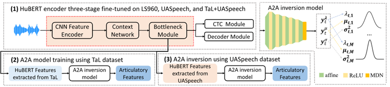
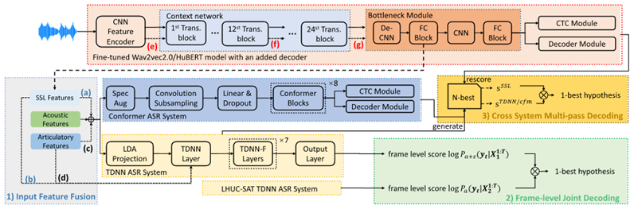
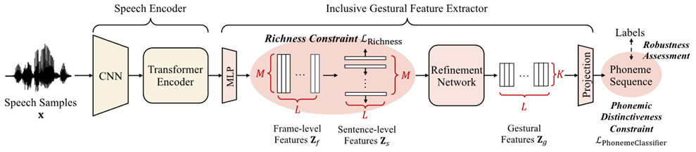
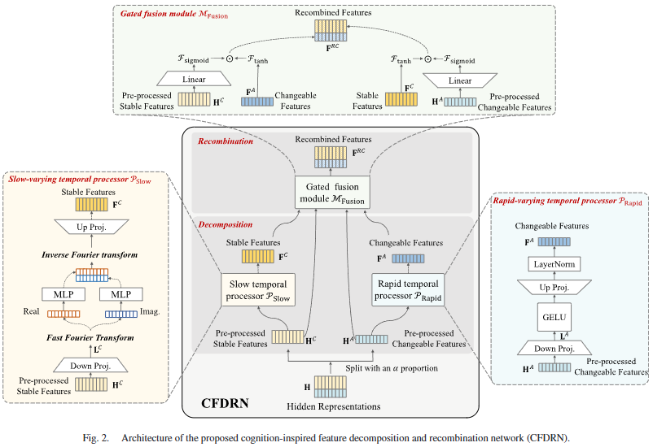

# 病理语音识别

除了用病理数据微调预训练模型这类常见方法外，有发音特征反演、针对性网络模块、病理语音合成。发音特征指的是发音器官的动作描述，比如舌头运动规律、嘴唇开合角度等。

* PPFR-conformer for dysarthria speech recognition: from phoneme perception to feature refinement. 属于哪类方法？
* CFDRN: A Cognition-Inspired Feature Decomposition and Recombination Network for Dysarthric Speech Recognition. 怎么做的？
* Overview of Automatic Speech Analysis and Technologies for Neurodegenerative Disorders: Diagnosis and Assistive Applications. 简单看看这篇论文在讲什么？迅速判断有没有读下去的必要。
* Convolution-Augmented Transformers for Enhanced Speaker-Independent Dysarthric Speech Recognition. 这是TNNLS25年的论文，最好认真看看。
* 

## 1. 发音特征反演

### 1.1 监督条件下的发音特征反演

* Self-supervised asr models and features for dysarthric and elderly speech recognition,**TASLP**, 2024,香港中文大学
  * 音频特征转换后做为高斯混合模型(GMM)的参数，然后用GMM模型来逼近真实发音动作（如舌头位置、嘴唇开度等，做为标签）在给定音频特征下的概率分布。
  * 这篇论文主要是将反演后的发音特征与声学特征进行融合。

### 1.2 无监督条件下的发音特征反演

* Gestural feature extraction and multi-feature co-activation for dysarthric speech recognition,**information** **fusion**, 2025, 天津大学
  * 如下图所示，Richness Constraint损失表示让Zs的特征之间正交的结果趋向于零，作者认为特征正交会促使模型保留更多的细节信息；同时在最终输出端再加上一个与音素相关的约束。这种模式下，作者认为学习到了一些发音特征。
  * 与有监督发音特征反演的思路区别在于：本文不需要parallel acoustic-articulatory training data，因为articulatory数据较难获取（特殊仪器才能采集），而是通过音素标签学习到潜在的articulatory特征。

## 1.2 针对性网络模块

* CFDRN: A Cognition-Inspired Feature Decomposition and Recombination Network for Dysarthric Speech Recognition, **TASLP**, 2023, 天津大学
  * 没细看，大致思路是：受到认知科学的启发，从adapter方法的改进入手，设计了一些参数高效的adapter变体。

## 1.3 病理语音合成

* From Substitution to Complementarity: LeveragingBERT-VITS2 and Real Speech for Better ChineseDysarthric Speech Recognition
* Accurate synthesis of dysarthric Speech for ASR data augmentation
* Personalized Fine-Tuning with Controllable Synthetic Speech from LLM-Generated Transcripts for Dysarthric Speech Recognition
