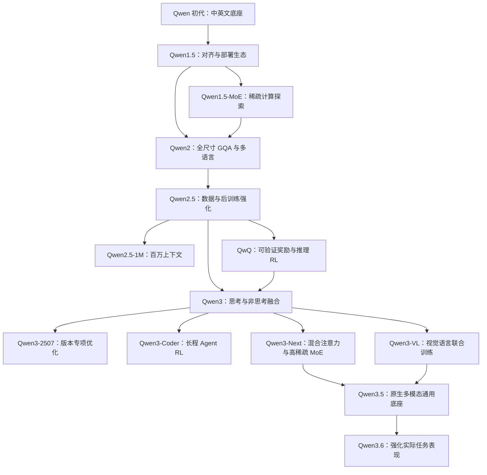

# Qwen LLM 系列发展脉络与技术变革

> 整理日期：2026-09-18。以官方技术报告、发布博客和模型卡为依据。
> 范围：重点讨论通用语言模型及影响其演进的推理、代码、长上下文分支；多模态只讨论与主线融合的关键节点，不逐一罗列 VL、Audio、Omni、Image 产品。
> 阅读口径：下文“技术判断”是基于公开资料的归纳；评测数字为官方报告结果，未经本文独立复现。较新版本的披露完整性见第 5 节。

## 1. 核心结论：Qwen 的进步来自哪些变量？

Qwen 的发展可以看作优化目标的逐步扩展：先建立中英文通用底座，再改善部署和多语言能力，随后扩大高质量数据与后训练，进而把推理时计算、工具反馈、稀疏计算和多模态输入纳入统一设计。

理解这条路线，最有用的是追踪五个变量：

| 变量 | 要解决的问题 | 代表转折 |
| --- | --- | --- |
| 数据与预训练 | 模型能学到多少知识、代码与数学规律？ | Qwen2 → Qwen2.5 → Qwen3 |
| 后训练与推理预算 | 如何把已有知识转化为可靠的解题能力？ | QwQ → Qwen3 |
| 计算结构 | 怎样增加模型容量而控制每个 token 的计算成本？ | Qwen1.5-MoE → Qwen3 MoE → Qwen3-Next |
| 上下文与环境交互 | 能否处理整份材料，并在工具反馈中完成多步任务？ | Qwen2.5-1M、Qwen3-Coder |
| 模态融合 | 文字、图表、图像和视频能否参与同一个推理过程？ | Qwen3-VL → Qwen3.5 |

**本文的技术判断：最值得关注的三次转折，是 Qwen2.5 的数据与后训练成熟化、QwQ／Qwen3 的推理范式转变，以及 Qwen3-Next／Qwen3.5 的计算结构与模态融合。**版本号并不等于技术变革幅度，“.5”也可能包含重要变化。

## 2. 一张表看清代际变化

日期按所引官方发布页或仓库记录；同一系列可能分批发布。`B` 表示十亿参数，`T` 表示万亿 token；`A` 后的数字表示每个 token 的激活参数规模。

| 阶段 | 时间 | 代表模型／形态 | 相比上一阶段的主要变化 | 技术定位 |
| --- | --- | --- | --- | --- |
| Qwen 初代 | 2023-08 起 | 7B，后续 14B、1.8B、72B | 建立预训练底座与 Chat 模型，重视中英文、代码和工具使用 | 建立基础能力 [1][2] |
| Qwen1.5 | 2024-02 起 | 多档 Dense；后续 32B、110B、MoE | 对话偏好、多语言、统一 32K 上下文及主流框架集成 | 让模型更易用 [3] |
| Qwen1.5-MoE | 2024-03 | MoE-A2.7B | 开始明确探索少量激活参数支撑更大容量 | 稀疏计算先行 [4] |
| Qwen2 | 2024-06 | 0.5B、1.5B、7B、57B-A14B、72B | 全尺寸 GQA、29 种语言的数据覆盖，部分型号 128K | 通用能力与效率升级 [5] |
| Qwen2.5 | 2024-09 | 开放 Dense 0.5B–72B | 预训练数据上限从 7T 增至 18T，强化数学、代码、指令与结构化输出 | 数据和后训练驱动 [6][7] |
| 2.5 阶段的分支 | 2025-01—03 | 1M、Max、QwQ-32B | 分别探索百万上下文、大规模 MoE、强化学习推理 | 三条能力路线并进 [9][10][11] |
| Qwen3 | 2025-04 | Dense 0.6B–32B；30B-A3B、235B-A22B | 思考／非思考融合、36T 数据、119 种语言和方言 | 推理成为通用底座能力 [12][13] |
| Qwen3-2507／Coder | 2025-07 | Instruct 更新、480B-A35B Coder | 独立非思考版本强化；代码路线向多轮工具交互扩展 | 从回答走向任务执行 [14][15] |
| Qwen3-Next | 2025-09 | 80B-A3B | 混合注意力、高稀疏 MoE、MTP | 重新设计长上下文成本 [16][17] |
| Qwen3-Max | 2025-09 | 超 1T 参数的 API 模型 | 扩大 MoE 容量并改进大规模训练系统 | 旗舰规模路线 [18] |
| Qwen3.5 | 2026-02 起 | 首发 397B-A17B | 继承 Next 架构，早期视觉文本融合，扩大 Agent RL | 原生多模态通用底座 [19][20] |
| Qwen3.6 | 2026-04 | 27B Dense、35B-A3B、API 型号 | 公布的进步集中于 Agentic Coding 和任务可靠性 | 实际任务能力继续强化 [21][22] |
| Qwen3.7／3.8 | 截至整理日已有官方产品记录 | 3.7-Plus／Max、3.8-Max | 产品层可以确认；不足以据此重建完整训练与架构差异 | 单列披露边界 [23][24] |

## 3. 逐代拆解：究竟改变了什么？

### 3.1 Qwen 初代：建立可扩展的中英文底座

初代采用 decoder-only Transformer，包含 RoPE、RMSNorm、SwiGLU 等组件，使用约 15 万规模的词表，兼顾中文、英文及代码编码。报告披露的预训练规模最高约 3T token，并讨论 SFT、奖励模型及 RLHF。这里应区分“论文中的训练实验”和“具体开放 checkpoint 的训练状态”，不能认定每个 Chat 权重都使用了相同 RLHF 流程。[1]

开放模型从 2023-08-03 的 7B 开始，随后补充其他尺寸。初代不同模型的上下文规格并不一致，例如仓库列出的 14B 为 8K，而部分其他型号为 32K。[2]

**技术判断：**这一阶段的意义在于建立模型、数据处理、对齐和开发接口的基础体系。工具调用并非后期才突然出现；后续真正变化的是它在训练和评测中的分量。

### 3.2 Qwen1.5：把“有模型”推进到“容易使用”

相对初代，1.5 的显著变化是更好的对话偏好、多语言表现和统一的 32K 上下文支持；模型接入 Transformers，减少了对自定义远程代码的依赖，量化与推理框架适配也更加完整。32B、110B 等是后续补充，不能把当前汇总页面中的全部型号都算作首发阵容。[3]

随后发布的 Qwen1.5-MoE-A2.7B 表明：增加模型容量，可以通过专家路由实现，而不必让所有参数在每个 token 上都参与计算。[4]

**相对上一代的本质变化：**模型质量继续改善，同时把部署、微调、量化的使用成本纳入产品设计。MoE 在此时已出现，因此“Qwen3 首次引入 MoE”是不准确的。

### 3.3 Qwen2：GQA 全面化，多语言和长上下文成为主线

Qwen2 对所有尺寸使用 GQA，而 Qwen1.5 仅部分型号采用。GQA 让多组查询头共享较少的 K/V 头，减少 KV cache 需求，有利于生成阶段的显存占用与吞吐。该系列包含 Dense 和 57B-A14B MoE，训练语种覆盖中文、英文及另外 27 种语言。[5]

上下文仍需按型号看：官方发布表中 0.5B／1.5B 为 32K，57B-A14B 为 64K，7B／72B 的指令模型支持 128K。官方同页对照中，72B 的 HumanEval 从 Qwen1.5 的 71.3 提升到 86.0，IFEval 从 55.8 到 77.6。[5]

**相对上一代的本质变化：**把推理效率、跨语言能力和更复杂任务的指令遵循一起提升。GQA 是工程效率变化，能力增长则还来自数据与训练，不能全归功于注意力结构。

### 3.4 Qwen2.5：架构延续，数据和后训练成为主要增益来源

开放通用主线仍是 Dense decoder-only 模型，覆盖 0.5B、1.5B、3B、7B、14B、32B、72B。预训练数据上限由 Qwen2 的 7T 增至 18T；同时加强数学、代码、长文本生成、表格理解、JSON 输出及系统指令适应性。[6][7]

技术报告把预训练和后训练共同作为改进来源，后者包含大规模监督微调及强化学习。因此，把 2.5 理解成“只是多喂一些网页”会遗漏重要变化。[8]

官方 2.5 发布页给出的同表对照中，72B-Instruct 的 MATH 从 69.0 增至 83.1，Arena-Hard 从 48.1 增至 81.2。这些是特定评测协议下的结果，不能与其他博客里不同口径的同名分数直接拼接。[7]

**相对上一代的本质变化：**从“能力强”进一步走向“按要求稳定完成任务”。对科研应用而言，按字段抽取信息、保持输出格式和遵循复杂约束，可能比单一知识问答分数更有实际价值。

### 3.5 QwQ：从偏好对齐走向可验证结果驱动的推理

QwQ 是理解 Qwen2.5 到 Qwen3 的关键桥梁。2025-03 发布的 QwQ-32B 从冷启动 checkpoint 出发，先在数学和代码上扩大 RL：数学使用答案验证，代码使用执行与测试结果；之后再通过通用奖励与规则验证改善其他能力。[11]

这里的转变在于反馈信号：除“回答是否符合偏好”，还直接关注“能否解对、能否执行成功”。推理阶段生成更多中间步骤，也使计算投入可以随任务而变。

**技术判断：**预训练提供能力基础，RL 改善能力的使用方式，而推理预算提供运行时的调节空间。三者相互配合。思考更长不保证正确，也不能代替检索、实验或计算验证。

### 3.6 Qwen3：把快答与深度推理放进同一个模型

Qwen3 首发将 thinking 与 non-thinking 两种模式合入同一 checkpoint，并支持思考预算控制。其旗舰后训练流程为：长 CoT 冷启动 → 推理 RL → 思考模式融合 → 通用 RL。这与此前通过不同模型分别承担日常对话和深度推理的使用方式有明显区别。[12]

预训练扩大到约 36T token、119 种语言和方言；架构保留 GQA 等基础设计，同时移除 QKV bias、引入 QK-Norm。MoE 型号使用 128 个专家、每 token 激活 8 个，不设共享专家；小模型还通过强到弱蒸馏承接大模型能力。报告覆盖的开放模型采用 Apache 2.0。[13]

**相对 Qwen2.5 的本质变化：**既增强底座，又改变了模型的推理使用方式。部署者开始同时选择参数规模、是否思考以及思考预算。

需要注意：初版的混合模式并不代表后续所有 Qwen3 型号都支持切换。`Qwen3-235B-A22B-Instruct-2507` 明确是非思考模型，其原生上下文为 262,144 token，当前模型卡另列扩展方案。[14]

### 3.7 Qwen3-Next：同时降低专家计算和长上下文成本

Next 的核心并非简单加大参数，而是组合 Gated DeltaNet 与 Gated Attention，并采用高稀疏 MoE 和多 token 预测（MTP）。80B-A3B 的模型卡列出 48 层，按三个 DeltaNet 层加一个注意力层重复；512 个路由专家中每次激活 10 个，另有一个共享专家。[16]

这条路线与 Qwen3 的普通注意力 MoE 有结构差异。MoE 主要控制专家层计算量；混合注意力则针对序列建模的成本。二者处理的是不同瓶颈。官方将其定位为训练和推理效率路线，而非普通的型号扩容。[17]

**技术判断：**长上下文 Agent 会积累大量文件和工具返回内容，因此降低“读长历史”的代价，与提升单题推理能力同样重要。混合架构保留全注意力层，不能把整个模型概括为完全线性复杂度。

### 3.8 Qwen3.5：高效架构与原生多模态汇合

Qwen3.5 首发 397B-A17B 延续 Next 的混合架构。官方说明强调视觉与文本的早期融合、更广泛的多模态训练，以及在更多、更复杂的任务环境中扩展 RL；语言和方言支持由 119 扩至 201。[19]

模型卡进一步给出：语言模型部分共 60 层，继续采用 3:1 的 DeltaNet／Attention 组合，512 个专家、激活 10 个路由专家加一个共享专家；原生上下文为 262,144 token，可扩展至 1,010,000 token。托管的 Qwen3.5-Plus 默认百万上下文是另一层产品规格。[20]

**相对 Qwen3 的本质变化：**通用底座同时吸收了 Next 的效率路线和视觉语言路线。对于科研材料，图表、公式截图、正文与视频可以进入同一个任务过程。但“原生多模态”不自动意味着支持音频输入或图像生成，应按具体模型输入输出规格判断。

### 3.9 Qwen3.6：任务能力进步，不必等同于架构重做

Qwen3.6-27B 的官方发布重点是 Dense 模型的 Agentic Coding，并保留视觉语言思考／非思考模式。其发布页给出的同尺度对照为：Qwen3.5-27B → Qwen3.6-27B，SWE-bench Verified 75.0 → 77.2，Terminal-Bench 2.0 为 41.6 → 59.3。[21]

这些成绩涉及特定工具框架、采样与资源配置；不能直接推导为任何环境下都能达到同样成功率。Max-Preview 的公告也主要披露任务表现与产品使用方式，并未给出足以重建整个系列训练方法的细节。[22]

**相对上一代的本质变化：**可确认的是面向软件工程与工具任务的能力增强。本文不将这些结果擅自解释为某种未披露的新注意力或新 RL 算法。

## 4. 不能漏掉的三条支线

### 4.1 长上下文：从“放得下”到“处理得动”

Qwen2.5-1M 于 2025-01 开放 7B 和 14B 两个型号，并配套发布推理框架。这说明百万上下文不仅是修改一个长度参数，还需要相应的训练、外推和推理优化。[9]

它带来的能力边界应拆成三个问题：

1. **容量：**输入是否能被系统接收？
2. **质量：**能否定位细节，并进行跨段整合推理？
3. **成本：**读取和生成的时延、显存、吞吐是否可接受？

单一“大海捞针”成绩不能覆盖后两个问题；文献综述更应测试跨论文归纳、冲突证据识别和引用定位。

### 4.2 代码与数学：专用能力向通用模型回流

Qwen2.5-Math 强调合成数学数据、奖励模型引导的迭代训练，以及工具集成推理。工具的作用是让计算结果参与求解，而不仅是生成一段看起来合理的数学文字。[25]

Qwen3-Coder 则把路线推进至多轮环境交互：首发 480B-A35B，原生 256K 上下文，训练中使用执行驱动的代码 RL 和长程 Agent RL；模型需要读代码、操作工具、接收反馈再修正方案。[15]

**技术判断：**代码任务的价值不只在“会编程”，还在于它提供较清晰的执行反馈。测试、解释器和可复现环境，为训练更长程的任务行为提供条件。

### 4.3 Max：开放权重之外并行的规模路线

Qwen2.5-Max 是大规模 MoE，官方披露其预训练超过 20T token，并通过 API 提供。它并不是把开放版 Qwen2.5-72B 改个产品名称。[10]

Qwen3-Max 官方披露超 1T 参数、36T token，并强调 MoE 训练效率、并行系统和长上下文训练的改进。[18]

因此，阅读 Qwen 历史时应同时保留两条线：开放模型的可部署性，以及托管旗舰探索的容量上限。`Max`、`Plus`、`Turbo` 等服务名称，不能直接用来反推一个固定的开放 checkpoint。

## 5. 较新版本的核验边界：Qwen3.7 与 Qwen3.8

本次核查中，官方 API 平台已列出 Qwen3.7-Max 和 Qwen3.7-Plus，二者页面均标注百万级上下文；官方 Qwen Studio 模型说明页也已出现 Qwen3.8-Max，列出文本、图像和视频模态。[23][24]

但上述产品页面不足以回答以下问题：相较 3.6 的具体架构差异、预训练 token 数、RL 配方、激活专家数，以及对应权重的实际公开状态。本次未取得足够完整、可相互核对的技术报告与官方权重记录，因此**只确认产品存在，不把未知机制写成确定的代际创新**。

这也意味着：本文的详细技术分析主要到 Qwen3.6，并非宣称 Qwen3.6 是截至整理日的最新版本。后续补充应优先核对正式发布文、模型配置、权重仓库和技术报告，而非仅凭版本名或宣传摘要填表。

## 6. 技术演进图

以下箭头表示能力路线与公开设计的承接关系，不代表每个模型都从前一个模型权重继续训练。

Qwen3-VL 官方披露了早期文本视觉联合预训练、Interleaved-MRoPE 与 DeepStack 等设计，是理解后续模态融合的重要背景；它与文本主线相关，但不是普通 Qwen3 文本模型自带的全部能力。[26]

## 7. 比较时最容易出现的六个误区

| 误区 | 更准确的比较方式 |
| --- | --- |
| 参数越多一定越强 | 同时比较数据、训练阶段、激活规模、任务类别和推理预算 |
| A3B 就等于 3B Dense 的部署成本 | A3B 主要描述激活计算；MoE 全部权重仍需存储，通信与路由也有代价 |
| 版本号更新就一定换架构 | 分别检查注意力、专家结构、训练配方、后训练和产品配置 |
| 支持 1M 就表示原生训练了 1M | 区分训练长度、原生支持、外推配置和 API 上限 |
| 不输出思考就没有推理能力 | non-thinking 描述输出／训练模式，不意味着只能机械检索答案 |
| 开放权重等于完整可复现 | 仍需检查训练数据、训练代码、配方和许可证是否公开 |

如果制作横跨多代的性能曲线，至少应记录：完整 checkpoint 名称、Base／Instruct／Thinking、评测集版本、是否使用工具、采样次数、最大输出长度及 Agent 框架。特别是数学、代码和 Agent 任务，测试时多给计算与工具本身就可能改变成绩。

## 8. 对科研阅读与实验设计的启发

以下为本文根据前述技术路线提出的实验思路，不是官方结论。

| 想研究的问题 | 可采用的实验思路 | 需要控制的混杂因素 |
| 数据和后训练能带来多少增益？ | 比较 Qwen2 与 Qwen2.5 同尺寸、同任务表现 | Base／Instruct、提示模板、数据污染；发布模型无法完全隔离变量 |
| 长思考是否值得其成本？ | 对支持双模式的同一 Qwen3 checkpoint 控制思考预算 | 总生成 token、时延、采样温度与工具使用 |
| MoE 的实际效率如何？ | 同时报告质量、吞吐、首 token 延迟和显存 | 硬件、量化、批大小、总参数与激活参数 |
| 混合注意力改善了什么？ | 让上下文长度逐级增长，测读取速度、检索与整合质量 | 推理框架成熟度、缓存策略、原生与外推长度 |
| 模型能否真正辅助科研？ | 用真实论文测试事实抽取、图表理解、代码复现和引用核对 | 外部搜索、解释器、人工校验和失败重试预算 |

组织相关工作时，可按“预训练扩展 → 推理后训练 → 高效结构 → 环境交互 → 多模态融合”展开；版本时间线用于定位事件，技术轴用于解释为什么发生变化。这样的写法更适合研究综述，也更容易与其他模型家族比较。

## 9. 官方资料索引

正文编号与下列链接对应。动态博客和模型卡可能继续更新；引用论文时优先固定报告版本，复现实验时另外保存 checkpoint revision。

1. [Qwen Technical Report](https://arxiv.org/abs/2309.16609) — 初代架构、数据及对齐研究。
2. [Qwen 官方仓库](https://github.com/QwenLM/Qwen) — 初代模型发布日期与规格。
3. [Introducing Qwen1.5](https://qwenlm.github.io/blog/qwen1.5/) — 生态、上下文与对齐改进。
4. [Qwen1.5-MoE](https://qwenlm.github.io/blog/qwen-moe/) — 早期稀疏专家探索。
5. [Hello Qwen2](https://qwenlm.github.io/blog/qwen2/) — GQA、尺寸、上下文及代际评测。
6. [Qwen2.5: A Party of Foundation Models](https://qwenlm.github.io/blog/qwen2.5/) — 系列构成与发布概览。
7. [Qwen2.5-LLM](https://qwenlm.github.io/blog/qwen2.5-llm/) — 与 Qwen2 的直接对照。
8. [Qwen2.5 Technical Report](https://arxiv.org/abs/2412.15115) — 预训练及后训练。
9. [Qwen2.5-1M 发布说明](https://qwenlm.github.io/blog/qwen2.5-1m/)；[技术报告](https://arxiv.org/abs/2501.15383) — 长上下文与推理系统。
10. [Qwen2.5-Max](https://qwenlm.github.io/blog/qwen2.5-max/) — API 旗舰 MoE 路线。
11. [QwQ-32B](https://qwenlm.github.io/blog/qwq-32b/) — 数学、代码及通用 RL。
12. [Qwen3: Think Deeper, Act Faster](https://qwenlm.github.io/blog/qwen3/) — 双模式与后训练流程。
13. [Qwen3 Technical Report](https://arxiv.org/abs/2505.09388) — 架构、数据和蒸馏。
14. [Qwen3-235B-A22B-Instruct-2507 模型卡](https://huggingface.co/Qwen/Qwen3-235B-A22B-Instruct-2507) — 非思考版本的能力与上下文规格。
15. [Qwen3-Coder](https://qwenlm.github.io/blog/qwen3-coder/) — 执行反馈与长程 Agent RL。
16. [Qwen3-Next-80B-A3B-Instruct 模型卡](https://huggingface.co/Qwen/Qwen3-Next-80B-A3B-Instruct) — 混合注意力与专家配置。
17. [Qwen3-Next 官方发布文](https://qwen.ai/blog?from=research.latest-advancements-listHugging&id=4074cca80393150c248e508aa62983f9cb7d27cd) — 训练及推理效率路线。
18. [Qwen3-Max: Just Scale it](https://qwen.ai/blog?from=research.latest-advancements-list&id=241398b9cd6353de490b0f82806c7848c5d2777d) — 旗舰规模与训练基础设施。
19. [Qwen3.5 官方发布文](https://qwen.ai/blog?id=qwen3.5) — 原生多模态、效率与环境 RL。
20. [Qwen3.5-397B-A17B 模型卡](https://huggingface.co/Qwen/Qwen3.5-397B-A17B) — 具体架构与上下文规格。
21. [Qwen3.6-27B](https://qwen.ai/blog?id=qwen3.6-27b&lang=zh-CN) — 同尺度及跨尺度评测、评测条件。
22. [Qwen3.6-Max-Preview](https://qwen.ai/blog?id=qwen3.6-max-preview) — 托管预览版能力说明。
23. [Qwen API 平台](https://qwen.ai/apiplatform) — Qwen3.7 产品记录，动态页面。
24. [Qwen Studio 模型说明](https://chat.qwen.ai/legal-agreement/models) — Qwen3.8-Max 产品规格，动态页面。
25. [Qwen2.5-Math](https://qwenlm.github.io/blog/qwen2.5-math/) — 合成数据与工具集成推理。
26. [Qwen3-VL 官方发布文](https://qwen.ai/blog?from=research.research-list&id=b550154aa5ba6b812cdebba2b9dc1156c4369d40) — 视觉语言联合训练与结构变化。
