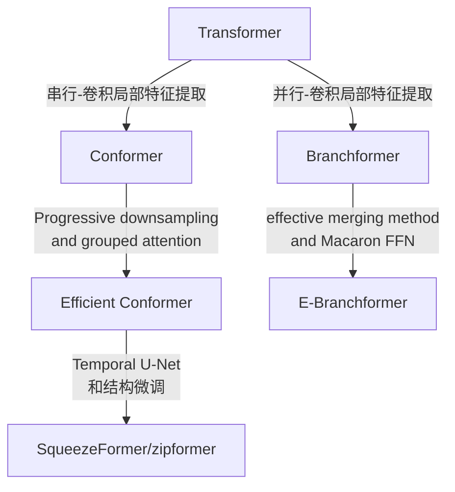
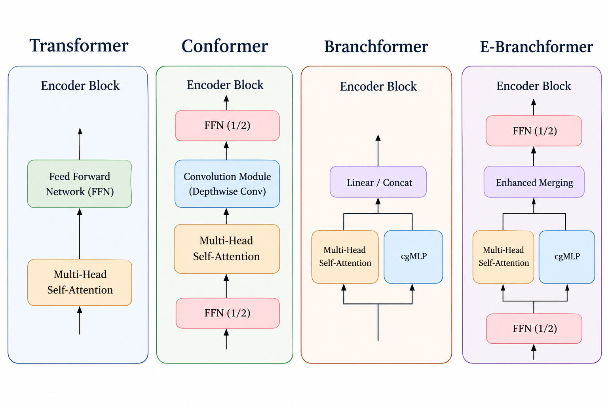
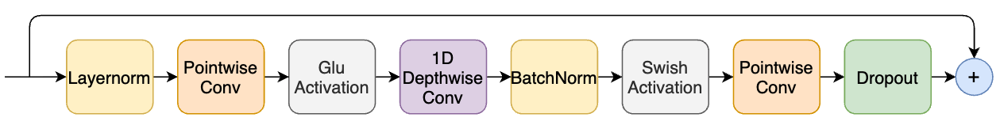
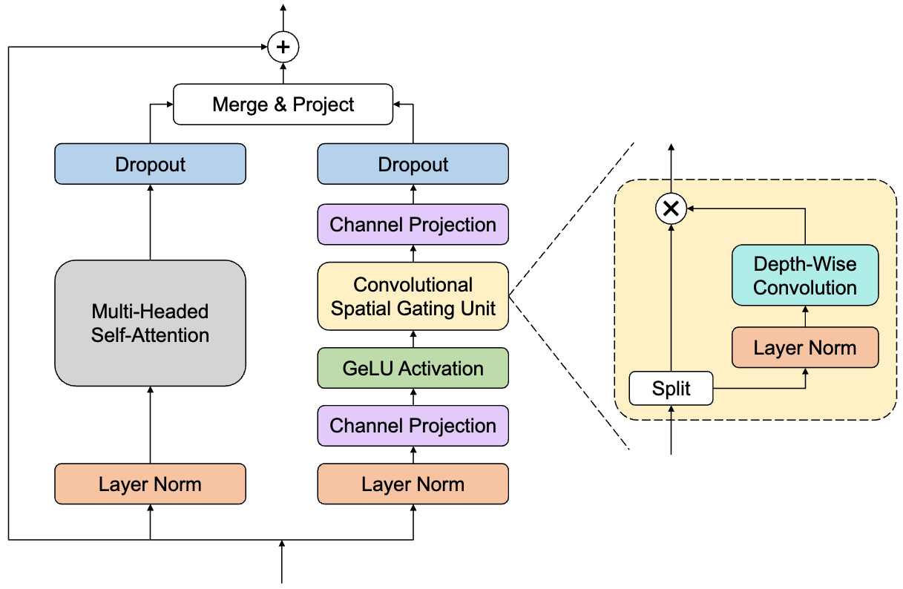

# Transformers for ASR

以RNN、LSTM为代表的这类模型，虽然具有天然流式、复杂度较低、延迟较低等优势，但也存在无法并行计算、scaling能力差、长程建模能力差等缺点。以Transformer为代表的各类模型，凭借自注意力机制具有的高效并行计算、长程建模能力强等优势，迅速成为学术界的主流ASR模型。本文以最近几年代表性的方法作为关键节点，进而粗略整理出ASR在模型架构设计、学习范式（主要指监督学习和自监督学习）上的脉络关系。

## Architecture Design

| 方向                            | 核心问题                                       | 代表模型 / 论文                                              |
| ------------------------------- | ---------------------------------------------- | ------------------------------------------------------------ |
| 1. 局部 + 全局建模              | Transformer 擅长长程依赖，但局部声学模式不够强 | Conformer, Branchformer, E-Branchformer                      |
| 2. 轻量化 / 高效建模            | Self-Attention 的\(O(T^2)\)成本高              | Lite Transformer, Efficient Conformer, Squeezeformer         |
| 3. 多尺度 / 分层建模            | 语音不同时间尺度信息不同                       | Squeezeformer, Zipformer                                     |
| 4. 流式 / 低延迟                | 标准 Transformer 依赖未来上下文                | Transformer-Transducer, Emformer, Streaming Conformer        |
| 5. Attention 本身改造           | 标准全局 MHSA 不一定最适合语音                 | local/chunk attention, grouped attention, relative attention |
| 6. Block / FFN / 归一化结构改进 | Transformer block 本身未必最适合 ASR           | Macaron-style FFN, cgMLP, BiasNorm, Swoosh等                 |

* [ ] 抽时间把方向2的代表性论文看一下

> Conformer的模型结构以及其中的卷积模块如下图所示，卷积模块的核心思想是来自于Lite transformer with long-short range attention ([Link](https://arxiv.org/pdf/2004.11886))。

> Efficient Conformer和SqueezeFormer的降采样策略区别在于后者在降采样后有升采样策略，表现为一个Temporal U-Net形式，而前者只包含降采样。

> Branchformer以及E-Branchformer论文中的卷积模块如下图所示，是在MLP中插入了一个CSGU的模块，其思想一部分来源于Mlp-mixer: An all-mlp architecture for vision ([Link](https://arxiv.org/pdf/2105.01601))、Pay attention to MLPs ([Link](https://arxiv.org/pdf/2105.08050))、MLP-based architecture with variable length input for automatic speech recognition ([Link](https://openreview.net/pdf?id=RA-zVvZLYIy)) 这三篇论文。

* Conformer和Branchformer系列的卷积模块总体上都是在MLP的中间加入了卷积操作，但有两点不同：1个是二者的MLP的中间维度不同，Conformer的较小，而Branchformer系列的较大，在高维空间上进行卷积操作更加耗时，这也导致Branchformer系列模型的训练时间较长些；2个是卷积操作的位置不同，conformer是将其置于glu后，而Brannchformer系列是将其置于glu的一个分支上。
* 根据目前自己在aishell1上跑的实验结果来看，Conformer模型在训练速度和性能上实现了一个很好的trade-off。E-Branchformer的确性能会更好些，但是其将卷积操作置于cgMLP的高维空间内，使得其训练速度较Conformer要慢。Branchformer在我的实验结果中，很难复现出原论文的效果，可能是一些细节遗漏了。

## Learning Paradigm

| 研究方向                                | 主要进展与核心问题                                                                         | 代表性论文与阅读清单                                                                                                                                                                                                                                                                                                                                                                                      | 阅读重点                                                                                                                       |
| --------------------------------------- | ------------------------------------------------------------------------------------------ | --------------------------------------------------------------------------------------------------------------------------------------------------------------------------------------------------------------------------------------------------------------------------------------------------------------------------------------------------------------------------------------------------------- | ------------------------------------------------------------------------------------------------------------------------------ |
| **综述与评价体系**                | 建立自监督语音学习的方法分类；从单一识别任务转向多任务评价。                               | ★[Self-Supervised Speech Representation Learning: A Review（2022）](https://arxiv.org/abs/2205.10643)★ [SUPERB: Speech processing Universal PERformance Benchmark（2021）](https://arxiv.org/abs/2105.01051)                                                                                                                                                                                              | 先建立整体框架；理解如何评价内容、说话人、情感等不同信息，以及冻结表征后的迁移能力。                                           |
| **1．自监督语音预训练**           | 利用无标注语音，通过对比学习、掩码预测和自蒸馏学习可迁移表征，降低人工标注需求。           | ★[wav2vec 2.0: A Framework for Self-Supervised Learning of Speech Representations（2020）](https://arxiv.org/abs/2006.11477)★ [HuBERT: Self-Supervised Speech Representation Learning by Masked Prediction of Hidden Units（2021）](https://arxiv.org/abs/2106.07447)[data2vec: A General Framework for Self-supervised Learning in Speech, Vision and Language（2022）](https://arxiv.org/abs/2202.03555) | 对比三种训练目标：**对比量化目标、预测聚类伪标签、预测教师连续表征**；理解目标设计如何影响学到的信息。                   |
| **2．通用、副语言与解耦表征**     | 从“说什么”扩展到“谁在说、怎么说”；根据任务需要保留或抑制身份、情感等信息。             | ★[WavLM: Large-Scale Self-Supervised Pre-Training for Full Stack Speech Processing（2021；期刊版 2022）](https://arxiv.org/abs/2110.13900)[ContentVec: An Improved Self-Supervised Speech Representation by Disentangling Speakers（2022）](https://arxiv.org/abs/2204.09224)[emotion2vec: Self-Supervised Pre-Training for Speech Emotion Representation（2023）](https://arxiv.org/abs/2312.15185)        | WavLM：掩码预测与去噪；ContentVec：内容与说话人解耦；emotion2vec：情感表征。关注**通用性与任务特定信息保留之间的关系**。 |
| **3．跨语言与低资源学习**         | 通过多语言共享表征实现知识迁移，研究规模扩展对低资源语言的帮助。                           | [Unsupervised Cross-lingual Representation Learning for Speech Recognition，XLSR（2020）](https://arxiv.org/abs/2006.13979)★ [XLS-R: Self-supervised Cross-lingual Speech Representation Learning at Scale（2021）](https://arxiv.org/abs/2111.09296)[Scaling Speech Technology to 1,000+ Languages，MMS（2023；JMLR 2024）](https://arxiv.org/abs/2305.13516)                                              | 从跨语言共享单元到千语言覆盖；重点看低资源语言结果、语言间干扰，以及数据规模和模型容量的作用。                                 |
| **4．语音—文本—视觉跨模态表征** | 利用文本的语言信息与唇形的发音线索，学习跨模态关联，支持识别、合成、翻译和唇读。           | ★[SpeechT5: Unified-Modal Encoder-Decoder Pre-Training for Spoken Language Processing（2021；ACL 2022）](https://arxiv.org/abs/2110.07205)[Learning Audio-Visual Speech Representation by Masked Multimodal Cluster Prediction，AV-HuBERT（2022）](https://arxiv.org/abs/2201.02184)                                                                                                                       | SpeechT5：语音与文本共享建模；AV-HuBERT：音频与视觉联合聚类预测。关注跨模态信息如何对齐和互补。                                |
| **5．离散语音表征与神经编解码**   | 将波形压缩成离散 token，兼顾语言内容、声学细节和可重建性，为语音大模型提供输入与生成单元。 | ★[SpeechTokenizer: Unified Speech Tokenizer for Speech Large Language Models（2023；ICLR 2024）](https://arxiv.org/abs/2308.16692)[WavTokenizer: an Efficient Acoustic Discrete Codec Tokenizer for Audio Language Modeling（2024）](https://arxiv.org/abs/2408.16532)[Moshi: a speech-text foundation model for real-time dialogue（2024，包含 Mimi 编解码器）](https://arxiv.org/abs/2410.00037)          | 语义与声学信息如何分配；token 速率、重建质量与延迟如何权衡。Moshi 可作为表征用于实时对话的系统案例。                           |
| **6．在线单元发现与高效训练**     | 将自蒸馏与在线聚类结合，减少离线聚类成本，学习更适合无文本语言建模的语音单元。             | ★[DinoSR: Self-Distillation and Online Clustering for Self-supervised Speech Representation Learning（2023）](https://arxiv.org/abs/2305.10005)[SpidR: Learning Fast and Stable Linguistic Units for Spoken Language Models Without Supervision（2025 预印本）](https://arxiv.org/abs/2512.20308)                                                                                                          | 在线聚类如何稳定训练、提升单元质量；语音单元的音系辨别能力与后续语言建模效果有何联系。                                         |

* [ ] 抽时间把自监督预训练相关的代表性方法了解下。
