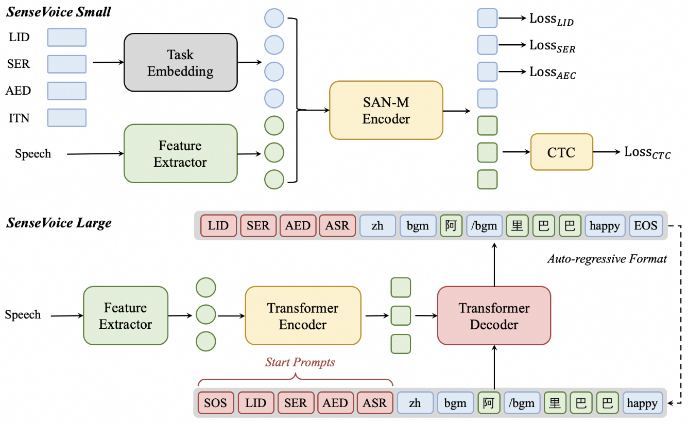

# Audio LLM

## Audio encoder

## connector

## Audio Multi-task Learning

在语音交互过程中，能识别用户语音、情感以及音频事件等内容很重要。考虑到推理延迟等因素，为不同的任务训练多个孤立模型是不可行的。因此，如何用一个模型实现多种音频任务显得尤为重要。该模型可为LLM提供多任务表征，是人机顺畅交互中的关键一环。

### Cascade

这种技术路线先训练音频模型，然后再将其与LLM串联成管道，最后再进行微调或者直接使用。相关的文献有如下。

* 2024, **FunAudioLLM**, Tongyi SpeechTeam, citation 105, [PDF](https://arxiv.org/pdf/2407.04051?), [Code(Inference and FT)](https://github.com/FunAudioLLM/SenseVoice), [Model](https://huggingface.co/FunAudioLLM/SenseVoiceSmall)
  * 只支持Automatic Speech Recognition (ASR), Language Identification (LID), Speech Emotion Recognition (SER), and Audio Event Detection (AED)四种任务，其实还有很多其他语音任务，比如语者识别、语音分离等
  * 当前的一种方案是将这个语音多任务模型的输出（即文本形式）输入到LLM，如果直接将语音特征作为LLM的输入，会显著增加计算负担，因为语音特征在时间维度上远大于文本。如何对语音特征进行有效的时间压缩，确保将其作为LLM输入时可以取得以文本输入时更好的效果？
  * 延迟如何？用扩散模型来做会不会进一步降低推理延迟？

