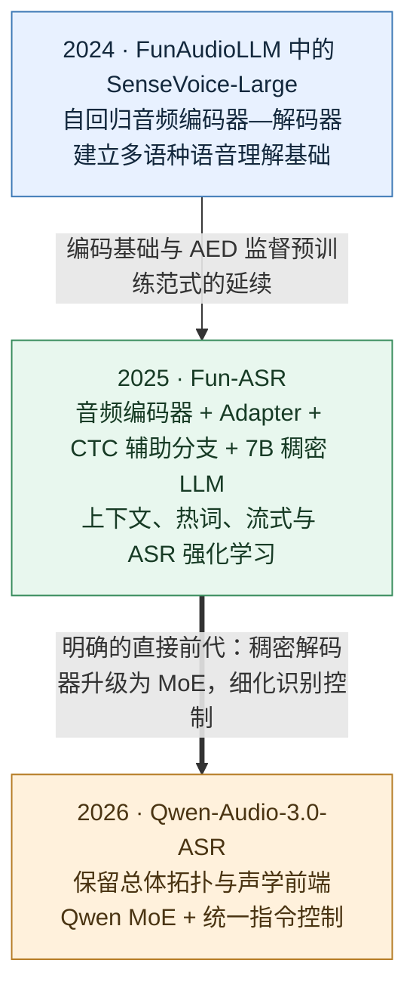
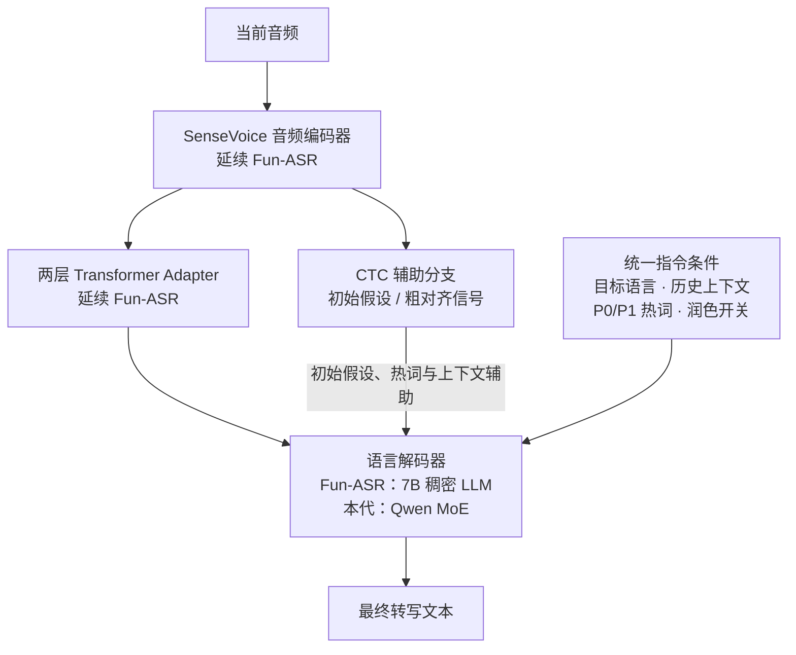
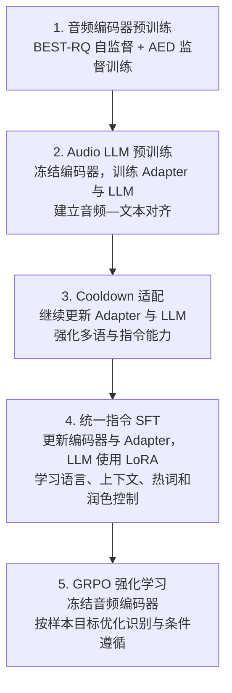

# Qwen-Audio-3.0-ASR：从 SenseVoice 到指令控制的语音识别

> 修订日期：2026-09-23。以三篇论文为主线：FunAudioLLM（仅 SenseVoice 部分）、Fun-ASR、Qwen-Audio-3.0-ASR。聚焦架构、训练目标和识别机制；不展开数据标注、旁支模型或产品端。

## 1. 为什么这三篇就足够构成主线

**FunAudioLLM 解释声学基础，Fun-ASR 解释直接前代，Qwen-Audio-3.0-ASR 解释本代升级。** 对一份聚焦目标论文的发展脉络，这三篇构成了足够清楚的最小阅读集合；若要复现某个具体算法，再单独追溯其方法论文。

三者关系并不完全相同：SenseVoice 提供音频编码与训练范式的来源；Fun-ASR 则被目标论文明确称为直接前代。不能把这条路线理解为三个完整模型依次继续训练，也不能把 FunAudioLLM 整个模型家族视为 ASR 前身。[依据：目标论文第 1–3 节](https://arxiv.org/html/2609.07549v2)

| 论文及首次提交日期 | 在本文中的作用 | 重点阅读 |
| --- | --- | --- |
| [FunAudioLLM，2024-07-04](https://arxiv.org/abs/2407.04051) | 解释 SenseVoice 声学基础 | §2.2，尤其是 SenseVoice-Large |
| [Fun-ASR，2025-09-15](https://arxiv.org/abs/2509.12508) | 解释直接前代的架构与已有能力 | §2 架构、§4 训练、§5 识别优化 |
| [Qwen-Audio-3.0-ASR，2026-09-07](https://arxiv.org/abs/2609.07549) | 解释 MoE、指令控制与后训练变化 | §2–3；§4.2 流式机制；§5 评测 |

日期为论文首次提交日期。下文 Fun-ASR 技术细节采用 v4（2025-12-19），目标论文采用 v2（2026-09-09），不把修订版新增内容倒推为首版内容。

## 2. FunAudioLLM：只保留 SenseVoice 的声学基础

SenseVoice-Large 是自回归 encoder-decoder 模型，通过解码器输入中的任务 token 控制识别行为，支持 50 多种语言，并联合建模语音识别、语言识别、情绪和音频事件。这里最相关的贡献是：**用多语种语音理解训练获得可供后续识别系统使用的音频编码能力。** [FunAudioLLM §2.2](https://arxiv.org/html/2407.04051)

Fun-ASR 的编码器监督预训练明确沿用 SenseVoice-Large 的 attention-based encoder–decoder（AED）范式：先训练音频编码器和自回归解码器，再将编码器用于 LLM-ASR。目标论文进一步明确，其音频前端采用 SenseVoice 编码器。[Fun-ASR §4.1](https://arxiv.org/html/2509.12508v4)、[目标论文 §2、§3.1](https://arxiv.org/html/2609.07549v2)

因此，应把这段关系写成“编码基础与训练范式延续”。它不意味着保留整个 SenseVoice-Large 原模型，也不意味着情绪、事件检测等任务都被完整继承。SenseVoice-Small 的非自回归路径无需在这份主线中展开。

术语提示：本文的 **AED** 指“基于注意力的编码器—解码器”；FunAudioLLM 中同一缩写也用于 Audio Event Detection（音频事件检测），两者含义不同。

## 3. Fun-ASR：把声学编码器接入 LLM，并建立四组件结构

Fun-ASR 的主模型由约 0.7B 音频编码器、两层 Transformer Adapter、CTC 辅助解码器和 7B 稠密 LLM 解码器构成。Adapter 连接音频表示与语言模型；CTC 提供初始识别假设；最终文本由 LLM 综合音频和文本条件生成。[Fun-ASR §2](https://arxiv.org/html/2509.12508v4)

这一步的变化是把预训练语言模型纳入识别过程，让它参与同音歧义消解、领域词汇选择和上下文建模。四组件结构随后被 Qwen-Audio-3.0-ASR 沿用。

Fun-ASR 已具备三类后续发展的基础，不能将它们全部当成目标论文首次提出的能力：

- **上下文与热词：** 利用前段转写辅助当前识别；依据 CTC 假设的语音或词片段距离检索热词候选，再交给 LLM。
- **流式与鲁棒性：** 通过模拟流式训练适应增量音频，并针对噪声、混说和幻觉优化。
- **ASR 强化学习：** 在 FunRL 框架中使用 GRPO，围绕识别错误、关键词、语言一致性和幻觉设置奖励。

这些机制见 [Fun-ASR §4–5](https://arxiv.org/html/2509.12508v4)。由此，后续演进的重点应放在“已有能力如何升级和统一”。

## 4. Qwen-Audio-3.0-ASR：继承与变化逐项对照

### 4.1 架构：四组件结构延续，语言解码器升级

目标论文明确保留 Fun-ASR 的总体拓扑、SenseVoice 音频编码器、两层 Transformer Adapter 和 CTC 辅助模块，主要结构变化是 **7B 稠密 LLM → Qwen MoE 主干**。[目标论文 §1–2](https://arxiv.org/html/2609.07549v2)

“保持不变”首先是论文对组件设计的描述，不应解释为所有训练阶段都冻结权重。例如目标论文 SFT 阶段仍更新音频编码器和 Adapter。

MoE 通过稀疏专家路由提供更大的语言知识容量，同时每个 token 仅激活部分参数。论文将其用于兼顾识别能力和解码计算开销，但没有给出足以确定具体总参数量、激活参数量的完整配置。CTC 仍是辅助分支，最终文本由 LLM 自回归生成。

### 4.2 能力：从已有增强机制到可组合的指令控制

| 维度 | Fun-ASR 已有基础 | Qwen-Audio-3.0-ASR 的推进 |
| --- | --- | --- |
| 多语种 | 中英主模型与独立多语模型 | 用运行时目标语言列表控制统一模型；覆盖 30 种语言、16 种中国方言变体 |
| 热词 | 从 CTC 假设检索候选，作为 LLM 条件 | 将候选分为 P0 高置信高优先级与 P1 广候选池，学习不同程度的偏置 |
| 历史上下文 | 用前段文本辅助当前片段；也训练无关上下文 | 显式处理正确、冲突、噪声和空上下文；与热词等控制条件联合使用 |
| CTC 辅助作用 | 初始假设和热词检索 | 继续保留，并用于长音频上下文注入的粗对齐 |
| 文本润色 | 未作为核心统一能力展开 | 润色开关控制逐字稿或清理后的文本，在识别解码中处理填充词、重复、自我修正和标点 |
| 流式 | 模拟流式数据训练增量识别 | 专用低延迟变体；音频块与右侧上下文可配置，句末用完整上下文刷新临时文本 |

来源：[Fun-ASR §4.3、§5](https://arxiv.org/html/2509.12508v4)、[目标论文 §3.4、§4、§5.4–5.5](https://arxiv.org/html/2609.07549v2)。

这里的关键变化是**这些条件能在同一识别指令中组合**。例如，“保留中英混说、参考前文的人名、优先考虑指定术语、输出去掉无意义重复的文本”，成为一个解码目标。

两处概念需要分清：原生润色的“单遍”指无需额外级联一个文本改写模型，并不表示流式流程绝不进行句末重识别；分层热词的 P0/P1 优先级也不是强制替换规则，仍需符合声学和上下文证据。

## 5. 训练演进：从声学预训练到统一后训练

Fun-ASR 已有“编码器预训练 → 分阶段音频—LLM 对齐 → 上下文 SFT → GRPO”的基础。目标论文进一步明确了五阶段流程，将大规模 Audio LLM 预训练和高质量 cooldown 适配单列出来，再通过统一指令 SFT 和 RL 优化识别行为。[Fun-ASR §4](https://arxiv.org/html/2509.12508v4)、[目标论文 §3](https://arxiv.org/html/2609.07549v2)

强化学习的变化也包含两个层面：

| 层面 | Fun-ASR | Qwen-Audio-3.0-ASR |
| --- | --- | --- |
| 算法 | GRPO | 继续采用 GRPO |
| 奖励重点 | 识别准确性、关键词、幻觉抑制与语言匹配 | 继续优化这些目标，并细化热词、上下文实体及其错误插入惩罚，按样本路由奖励 |
| 训练框架 | FunRL：音频编码、SGLang 候选生成与 FSDP 策略训练协调执行 | FunVerl-ASR：vLLM 候选生成、奖励计算与 Megatron 策略更新异步解耦 |

因此，不能把“引入 RL”视为本代首次贡献。更准确的变化是：**延续 GRPO，将奖励与统一控制能力结合，并改进训练系统的并行组织。** 两篇论文的硬件配置和训练工作量不同，不宜直接用训练耗时推导框架加速倍数。

## 6. 如何判断这些变化是否有效

阅读目标论文评测时，建议将问题对应到机制，而非只看一个综合排名：

- **基础识别与 MoE：** 看公共 ASR 基准，但跨模型分数变化不能单独证明 MoE 的收益，还同时受训练和其他机制影响。
- **分层热词：** 看启用前后的召回变化，并同时关注错误插入。论文内部实验中，P0 人名召回率由 62.12% 提升到 99.43%，属于特定测试设置下的结果。
- **长上下文：** 看跨片段实体是否保持一致。论文给出了代表性纠错例子；这些案例不等于完整量化消融。
- **润色：** 分开评价逐字识别与文本清理，检查否定、数字、实体和最终意图是否保留，不能只用逐字 WER/CER 判断可读性。
- **方言：** 论文内部 16 方言评测包含原方言转写与转为普通话的 AST 两种设置，宏平均 CER 9.40% 不能视为 16 个纯转写任务的统一成绩。
- **流式：** 同时考察首字延迟、临时文本稳定性和句末最终错误率，理解短音频块与右侧上下文的权衡。

上述数据、例子与评测设置来自[目标论文 §5](https://arxiv.org/html/2609.07549v2)；评估建议是本文的研究性归纳，未独立复现实验。

## 7. 适合综述中采用的归纳

FunAudioLLM 中的 SenseVoice-Large 为这条路线提供了多语种音频编码和 AED 训练基础。Fun-ASR 随后建立音频编码器、Adapter、CTC 辅助分支与稠密 LLM 协作的识别架构，并发展上下文、热词、流式和 ASR 强化学习。Qwen-Audio-3.0-ASR 在保留该总体结构的基础上，将语言解码器升级为 Qwen MoE，通过统一指令 SFT 和 GRPO 后训练，把语言选择、历史上下文、分层热词与原生润色整合为可组合的识别条件。

**三篇论文分别回答：声学基础从哪里来、LLM-ASR 结构如何形成、目标模型在哪些环节继续改进。** 其中 Fun-ASR 与目标论文应占主要篇幅，FunAudioLLM 只承担必要的来源说明。
