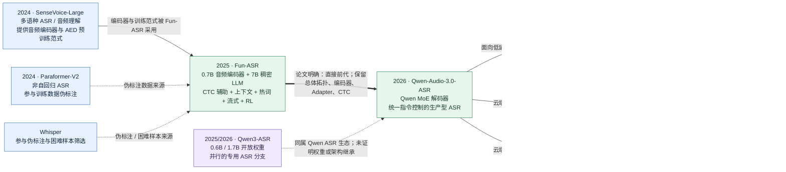
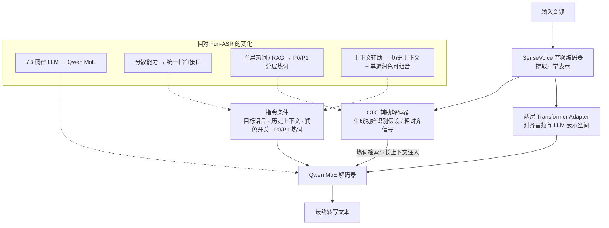
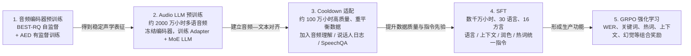

# Qwen-Audio-3.0-ASR 模型发展脉络

> 整理日期：2026-09-21
> 范围：只保留与 Qwen-Audio-3.0-ASR 存在直接架构继承、训练依赖、产品延续或必要对照关系的 ASR 模型与组件。Qwen-Audio、Qwen2-Audio、Qwen-Audio-3.0-TTS、Realtime 对话模型等虽然名称相近，但没有被已公开材料证明为该 ASR 模型的直接前代，因此不纳入主线。

## 1. 一句话结论

Qwen-Audio-3.0-ASR 的公开技术主线不是“Qwen-Audio → Qwen2-Audio → Qwen3-ASR”，而是：

**SenseVoice 提供音频编码基础 → Fun-ASR 建立“音频编码器 + Adapter + CTC 辅助假设 + 7B 稠密 LLM”生产型 LLM-ASR 框架 → Qwen-Audio-3.0-ASR 保留总体拓扑和音频前端，将稠密解码器升级为 Qwen MoE，并把多语种、方言、上下文、分层热词、单遍润色和流式识别统一到指令控制接口。**

Qwen3-ASR 与它同属 Qwen 语音识别生态，也同样采用“语音编码器 + Qwen 语言模型”的路线，但官方材料没有声明 Qwen-Audio-3.0-ASR 由 Qwen3-ASR 继续训练或改造而来。因此，本文将 Qwen3-ASR 视为**并行分支**，而不是直接前代。

## 2. 核心谱系图

读图规则：粗实线表示论文明确的直接代际关系；普通实线表示明确的组件或产品派生；虚线表示训练数据依赖或生态关联，**不代表检查点继承**。

## 3. 时间线：从基础组件到正式产品

| 时间               | 节点                                           | 与 Qwen-Audio-3.0-ASR 的直接关系                                                                   |
| ------------------ | ---------------------------------------------- | -------------------------------------------------------------------------------------------------- |
| 2024-07            | SenseVoice 随 FunAudioLLM 技术报告公开         | Qwen-Audio-3.0-ASR 论文明确写明沿用 SenseVoice 音频编码器；其 AED 训练范式也被用于编码器监督预训练 |
| 2024-09            | Paraformer-V2 技术报告                         | 与 Whisper、SenseVoice 一起参与大规模有标注数据的伪标签生成；属于训练数据管线依赖，不是结构前代    |
| 2025-09-15         | Fun-ASR 技术报告 v1                            | Qwen-Audio-3.0-ASR 论文明确称其为 predecessor；奠定四组件拓扑及生产优化方向                        |
| 2025-09 至 2026-01 | Qwen3-ASR 云服务与开放权重陆续出现             | 同属 Qwen 专用 ASR 生态，可用于理解同期技术路线；没有证据表明它是 3.0-ASR 的直接前代               |
| 2026-07-30         | 三个 Qwen-Audio-3.0-ASR-Flash 服务型号上线记录 | 形成短音频、长文件、实时流式三种产品入口                                                           |
| 2026-09-07         | Qwen-Audio-3.0-ASR 技术报告 v1                 | 首次系统披露架构、五阶段训练、产品能力与评测                                                       |
| 2026-09-09         | 技术报告 v2                                    | 截至本文整理日的最新论文版本                                                                       |

日期依据：[Fun-ASR arXiv 记录](https://arxiv.org/abs/2509.12508)、[Qwen-Audio-3.0-ASR arXiv 记录](https://arxiv.org/abs/2609.07549)、[阿里云模型发布记录](https://www.alibabacloud.com/help/en/model-studio/newly-released-models)。

## 4. 真正的代际变化：Fun-ASR → Qwen-Audio-3.0-ASR

### 4.1 架构：保留声学前端，重点升级语言解码器

两代模型都由四个核心部分组成：

1. Transformer 音频编码器；
2. 两层 Transformer Audio Adapter；
3. 位于音频编码器之上的 CTC 辅助解码器；
4. 根据音频表示与 CTC 初始假设生成最终文本的 LLM 解码器。

主要变化发生在第 4 部分：Fun-ASR 使用 7B 稠密 LLM 解码器；Qwen-Audio-3.0-ASR 改为 Qwen MoE 主干。MoE 通过稀疏专家路由扩大语言和世界知识容量，同时只激活部分参数，以控制每 token 计算开销。论文同时明确说明，SenseVoice 音频编码器、两层 Adapter 和 CTC 辅助模块被保留。

CTC 在这里不是最终识别器：它产生初始假设，供热词候选检索以及长音频上下文注入使用；最终文本仍由自回归 MoE LLM 生成。

### 4.2 能力与工程变化对照

| 维度       | Fun-ASR                                                  | Qwen-Audio-3.0-ASR                                              | 变化的实质                                               |
| ---------- | -------------------------------------------------------- | --------------------------------------------------------------- | -------------------------------------------------------- |
| LLM 解码器 | 7B 稠密模型                                              | Qwen MoE 主干                                                   | 增加总容量与多语知识，同时以稀疏激活控制解码成本         |
| 音频前端   | SenseVoice 编码器 + 两层 Adapter                         | 明确保持不变                                                    | 不是完全推倒重训，而是稳定声学前端上的解码与训练体系升级 |
| CTC 作用   | 初始假设、热词检索                                       | 保留，并增加长音频粗对齐信号用途                                | CTC 与 LLM 的协作更深入                                  |
| 多语种部署 | 中英主模型与 Fun-ASR-ML 多语模型分开；后者支持 31 种语言 | 单一指令接口覆盖 30 种语言和 16 种中国方言变体                  | 从“切换检查点”转为“运行时给目标语言列表”             |
| 热词       | 基于 CTC 假设检索热词并交给 LLM                          | P0 高优先级 + P1 广候选池的分层条件                             | 在召回长尾词与避免错误插入之间做更细粒度权衡             |
| 上下文     | 上一片段文本作为提示，增强长语音连续识别                 | 历史会话、热词和当前音频联合条件化；允许上下文不完整或错误      | 更强调音频证据优先，降低盲目复制上下文的风险             |
| 文本可读性 | 以转写为主                                               | 可按指令单遍去口头填充、重复、自我修正并规范标点                | 避免“ASR 后再调用 LLM 改写”的额外级联延迟              |
| 流式       | 用模拟流式数据适配增量解码                               | 专用 Streaming 变体，短块增量输出，句末用全上下文刷新           | 明确采用 coarse-to-fine 的低延迟与最终准确率折中         |
| 强化学习   | FunRL；SGLang rollout 与 FSDP policy 交替使用 GPU        | FunVerl-ASR；vLLM rollout、奖励模块、Megatron policy 全异步并行 | 面向大音频语言模型提高 RL 训练吞吐，并细化奖励路由       |

来源：[Fun-ASR Technical Report](https://arxiv.org/html/2509.12508)、[Qwen-Audio-3.0-ASR Technical Report](https://arxiv.org/html/2609.07549v2)。

## 5. 五阶段训练脉络

Qwen-Audio-3.0-ASR 的能力不是由一次微调得到，而是五个阶段逐步形成。

训练细节中，与其他 ASR 模型最直接的联系如下：

- 编码器的有监督 AED 阶段遵循 SenseVoice-Large 范式；AED 解码器完成训练后被丢弃，只保留编码器。
- Paraformer-V2、Whisper、SenseVoice 参与生成或校验伪标签。
- RL 困难样本来自基础模型与 Whisper、FireRed-ASR、SenseVoice 等外部系统的分歧。
- 音频编码器最初还用 Qwen3 LLM 的兼容 Transformer 层初始化，再把因果注意力改为双向注意力；这是跨模态初始化，不等于直接复用某个 ASR 检查点。
- SFT 阶段联合更新音频编码器和 Adapter；基础 LLM 参数冻结，通过 LoRA 适配解码器。RL 阶段音频编码器继续冻结，主要优化解码策略。

## 6. 产品形态：同一技术主线的三个服务入口

| 云端模型 ID                            | 交互方式           | 当前文档中的主要边界                        | 适合场景                           |
| -------------------------------------- | ------------------ | ------------------------------------------- | ---------------------------------- |
| `qwen-audio-3.0-asr-flash`           | HTTP，非实时       | 单文件最长 5 分钟；支持热词与 Prompt 上下文 | 语音消息、短录音、单段识别         |
| `qwen-audio-3.0-asr-flash-filetrans` | HTTP，异步文件转写 | 最长 12 小时 / 2 GB；支持说话人分离         | 会议、访谈、课程、批量归档         |
| `qwen-audio-3.0-asr-flash-streaming` | WebSocket，实时    | 持续流式输入；支持热词与上下文              | 实时字幕、语音输入、客服与交互应用 |

这些是服务层限制，不能反推底层网络一次前向就直接处理整段 12 小时音频。Filetrans 还可能包含切分、并发、说话人分离和结果聚合等服务编排。型号与限制以[阿里云 ASR 型号表](https://www.alibabacloud.com/help/en/model-studio/asr-model/)为准。

论文还提出 **Message ASR** 部署形态：流式音频先产生低延迟临时文本，在端点检测后用完整上下文刷新；历史文本、P0/P1 热词和润色指令可同时输入。它是 Qwen-Audio-3.0-ASR 的组合式部署方案，不是另一套独立基础模型。

## 7. 与 Qwen3-ASR 的关系：相关，但不是父子代

| 项目             | Qwen3-ASR                                              | Qwen-Audio-3.0-ASR                                                       |
| ---------------- | ------------------------------------------------------ | ------------------------------------------------------------------------ |
| 公开定位         | 开放权重专用 ASR 家族，0.6B / 1.7B；配套 ForcedAligner | 面向生产的指令控制 MoE ASR 系统与云端服务                                |
| 明确基础         | Qwen3-Omni 的音频理解基础                              | Fun-ASR 总体拓扑 + SenseVoice 音频编码器 + Qwen MoE 主干                 |
| 语言 / 方言口径  | 30 种语言 + 22 种中文方言                              | 30 种语言 + 16 种方言变体，跨 8 个主要方言区                             |
| 时间戳           | 通过独立的 Qwen3-ForcedAligner-0.6B                    | 公开报告重点是上下文、热词、润色与流式；不要自动套用 Qwen3-ForcedAligner |
| 开放形态         | 权重、代码、Transformers / vLLM 工具链                 | 截至整理日主要为技术报告、项目页和 Model Studio API；未核实公开权重      |
| 可否视为直接前代 | —                                                     | **不可以**：目前没有已核实的权重继承或继续训练声明                 |

因此，研究复现时要分别记录完整模型 ID：不能把 Qwen3-ASR-1.7B 的本地评测、语言覆盖、时间戳能力或参数量直接归到 Qwen-Audio-3.0-ASR 上。

## 8. 有代表性的已报告结果

以下数字用于说明新增能力的效果，不等同于独立复现：

- 内部 16 方言评测的宏平均 CER 为 **9.40%**；该评测同时混合“原方言转写”和“转为普通话”的 AST 任务，不能简单理解为 16 个纯 ASR 数据集。
- Common Voice 15 所评语种的宏平均错误率为 **4.57%**。
- 在论文统一 API 评测中，相对 Fun-ASR-Flash，Qwen-Audio-3.0-ASR 在 FLEURS-zh、FLEURS-en、LibriSpeech-clean、LibriSpeech-other 上错误率更低，但在 AISHELL-1、AISHELL-2、WeNetSpeech-net 上不一定更优。这说明升级并非所有数据集单调领先。
- 热词实验中，P0 人名召回率由无热词时的 62.12% 提升到 99.43%；P0 热点词由 63.08% 提升到 99.46%。这些属于论文内部设置，不应外推到所有业务词表。
- 多语、方言和行业实体中有一部分使用内部测试集；论文公开结果应与可复现公共基准分开陈述。

完整表格和评测口径见[技术报告第 5 节](https://arxiv.org/html/2609.07549v2)。

## 9. 容易写错的几件事

| 常见误写                                               | 更准确的表述                                                                   |
| ------------------------------------------------------ | ------------------------------------------------------------------------------ |
| “Qwen-Audio-3.0-ASR 是 Qwen3-ASR 的下一代”           | 官方明确的直接前代是 Fun-ASR；Qwen3-ASR 是并行分支                             |
| “Qwen-Audio、Qwen2-Audio 是它的前两代”               | 品牌名相似，但现有报告未给出直接架构或权重继承证据                             |
| “模型支持 46 种语言”                                 | 官方口径是 30 种语言 + 16 种中国方言变体，两者不能简单合并为 46 种独立语言     |
| “流式模型与离线模型完全相同”                         | 论文明确开发了专用 Streaming 变体，并采用增量假设 + 句末全上下文刷新的混合流程 |
| “润色只是 API 后处理”                                | 论文称其为同一解码过程中的原生单遍能力，由指令控制                             |
| “给了热词就一定输出热词”                             | P0/P1 是条件偏置，设计目标仍要求与声学和语义证据一致                           |
| “CTC 输出就是最终结果”                               | CTC 只提供初始假设、候选检索和粗对齐；最终文本由 MoE LLM 生成                  |
| “Filetrans 支持 12 小时，所以模型上下文就是 12 小时” | 12 小时是云服务文件限制，不是已披露的单次网络上下文长度                        |

## 10. 建议的研究阅读顺序

1. [Qwen-Audio-3.0-ASR 项目页](https://qwenaudio.github.io/qwen-audio-3.0-asr/)：先看能力边界、产品入口和示例。
2. [Qwen-Audio-3.0-ASR Technical Report](https://arxiv.org/abs/2609.07549)：重点读第 2–4 节，确认架构、五阶段训练和部署形态。
3. [Fun-ASR Technical Report](https://arxiv.org/abs/2509.12508)：对照四组件拓扑、上下文 SFT、热词 RAG、流式训练和 FunRL。
4. [FunAudioLLM / SenseVoice](https://arxiv.org/abs/2407.04051)：理解被沿用的声学编码器来源。
5. [Paraformer-V2](https://arxiv.org/abs/2409.17746)：理解训练数据管线中的非自回归伪标注模型。
6. [Qwen3-ASR 官方仓库](https://github.com/QwenLM/Qwen3-ASR)：只作为并行 ASR 分支和开放部署生态对照，不把它误画为直接前代。
7. [阿里云 ASR 型号表](https://www.alibabacloud.com/help/en/model-studio/asr-model/)与[发布记录](https://www.alibabacloud.com/help/en/model-studio/newly-released-models)：核对当前服务型号、区域、接口与时长限制。

## 11. 资料可信度与维护说明

- “Fun-ASR 是直接前代”“沿用 SenseVoice 编码器、Adapter 和 CTC”“稠密 LLM 替换为 Qwen MoE”均来自 Qwen-Audio-3.0-ASR 技术报告的明确表述，属于高置信度关系。
- Paraformer-V2、Whisper、SenseVoice 与本模型的联系主要是伪标注、筛选或编码器来源；它们不应全部画成代际前身。
- 云端服务文档会持续更新。做科研复现时应保存调用日期、区域、完整模型 ID、请求参数、热词与上下文内容，以及原始输出。
- 截至整理日，本文未核实到 Qwen-Audio-3.0-ASR 的公开权重与参数规模，因此不推测其总参数量、激活参数量或本地显存需求。
- Mermaid 图中的边标签已刻意区分“直接继承”“训练依赖”“产品派生”和“并行生态”；后续若出现权重或训练继承的官方说明，再把虚线升级为实线。
