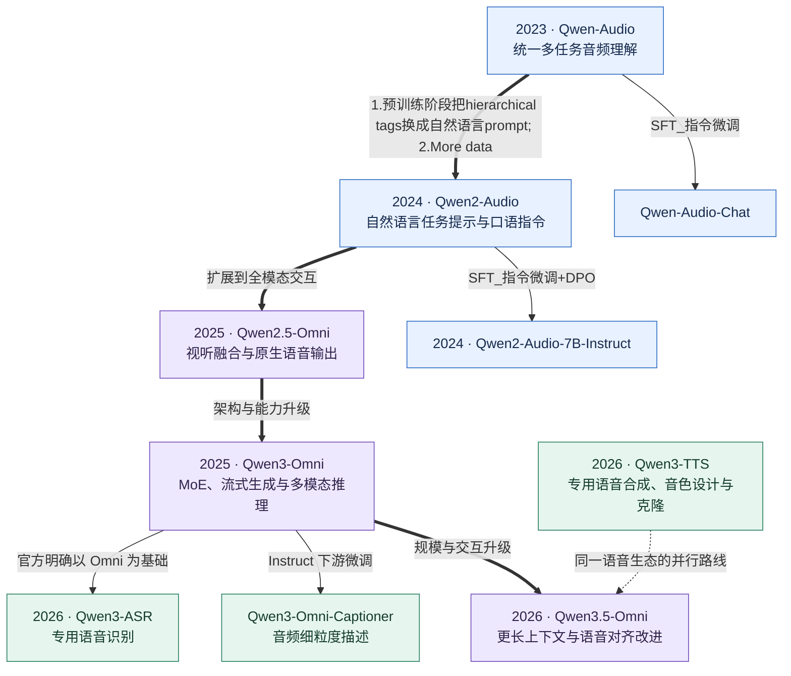
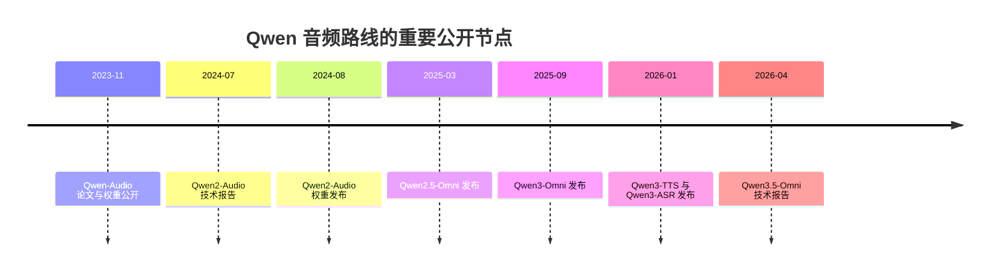
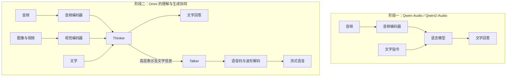

# Qwen-Audio 模型发展脉络

> 整理日期：2026-09-18。以官方论文、代码仓库和发布公告为依据；正文区分事实与研究解读。
> 范围：以 Qwen-Audio、Qwen2-Audio 为核心，延伸至已核实的 Omni 后续路线及 ASR、TTS 专用分支。图中的演进箭头表示技术路线变化，除特别注明外，不代表检查点之间直接继承权重。

## 1. 先看结论

这条路线可以概括为：**统一理解多种声音 → 听懂口语指令 → 同时看、听、说 → 提升多模态推理与流式交互 → 通用模型与专用语音模型并行发展。**

需要先分清三个概念：

- **Audio 理解模型**：Qwen-Audio、Qwen2-Audio 接收音频和文字，生成文字；能听懂语音不等于能原生合成语音。
- **Omni 全模态模型**：把音频能力放进文字、图像、视频共同参与的系统，并在相应版本中加入语音输出。
- **ASR / TTS 专用模型**：分别聚焦“声音转文字”和“文字转声音”，不是简单按代次替换整个 Audio 或 Omni 家族。

上述输入输出边界可对照 [Qwen-Audio 官方仓库](https://github.com/QwenLM/Qwen-Audio)、[Qwen2-Audio 官方仓库](https://github.com/QwenLM/Qwen2-Audio)及 [Qwen2.5-Omni 发布公告](https://qwenlm.github.io/blog/qwen2.5-omni/)。

## 2. 一张图看清主线与分支

先重点把第一个Qwen-Audio讲清楚（配合论文的网络结构图）-->Qwen2-Audio的改进点-->简单讲讲Qwen-omni 2.5和3（简单点，非重点）-->再接着讲Qwen3-ASR

这种类型的论文，没有经过同行评审。因为数据量庞大，做消融实验的成本太大。另外，这些作者经常会推翻前一个版本的某些设计，所以要带着批判性思维去看这些论文。

这些东西里面，哪些内容需要真正关注，哪些只需要了解即可？这块要搞清楚！

Qwen-Audio-3.0-ASR这是另一种技术路线，像是同一个公司，由不同的团队完成的，这个涉及到fun-asr相关的内容，后续另作文档进行分享。

讲完后，重点是讲讲自己的思考，尤其是可能的切入点，因为Qwen3-ASR的代码已经公开，而且很好上手：

1、如何微调这类模型？考虑清楚目前主流的微调方法有哪些不足

2、音频编码器和LLM的输入方式、结合方式等方面，目前的解决思路是将音频特征经过一个projector，然后与Prompt拼接后送入模型，通过next token prediction来训练。这样的方式存在哪些不足？如何改进？

3、后训练这块，其实数据量不多，如果能用peft的方式去做后训练，其实也还是可以的。当然要能指出当前后训练所存在的不足，然后再提出创新性且有效的方法。

以上三块内容是我们目前的算力还能支持的部分，如果说涉及到大规模数据pretraining的阶段，这个只有公司能承担，大部分高校均无法承担。另外，Qwen3-ASR的代码其实比espnet工具包好上手很多，如果以此代码库进行研究，或许能够加速科研，毕竟espnet入门还是很难的，所以这块也值得考虑！

**读图方式**：粗箭头是本文整理的技术演进关系；普通箭头标出官方说明的微调或基础模型关系；虚线只表示生态关联。尤其不能据此推断 Qwen3-TTS 是从某个 Omni 检查点直接微调而来。分支依据：[Qwen3-Omni 模型说明](https://github.com/QwenLM/Qwen3-Omni#model-description-and-download)、[Qwen3-ASR](https://github.com/QwenLM/Qwen3-ASR)、[Qwen3-TTS](https://github.com/QwenLM/Qwen3-TTS)。

## 3. 关键时间线

| 节点                   | 可核实日期 | 日期含义与资料                                                                                         |
| ---------------------- | ---------- | ------------------------------------------------------------------------------------------------------ |
| Qwen-Audio 论文        | 2023-11-14 | arXiv v1 提交日；官方仓库新闻记为 11-15，属于不同公开记录口径。[论文](https://arxiv.org/abs/2311.07919) |
| Qwen-Audio / Chat 权重 | 2023-11-30 | 两个检查点发布。[仓库](https://github.com/QwenLM/Qwen-Audio#news-and-updates)                           |
| Qwen2-Audio 论文       | 2024-07-15 | 技术报告公开。[论文](https://arxiv.org/abs/2407.10759)                                                  |
| Qwen2-Audio 权重       | 2024-08-09 | 7B 与 7B-Instruct 发布。[仓库](https://github.com/QwenLM/Qwen2-Audio#news-and-updates)                  |
| Qwen2.5-Omni           | 2025-03-27 | 官方发布公告日期。[公告](https://qwenlm.github.io/blog/qwen2.5-omni/)                                   |
| Qwen3-Omni             | 2025-09-22 | 官方仓库记录的发布日期。[仓库](https://github.com/QwenLM/Qwen3-Omni#news)                               |
| Qwen3-TTS              | 2026-01-22 | 开放 0.6B / 1.7B 系列。[仓库](https://github.com/QwenLM/Qwen3-TTS#news)                                 |
| Qwen3-ASR              | 2026-01-29 | ASR 系列和 ForcedAligner 发布。[仓库](https://github.com/QwenLM/Qwen3-ASR#news)                         |
| Qwen3.5-Omni 技术报告  | 2026-04-17 | arXiv v1 提交日，**不是首次产品发布日期**。[论文](https://arxiv.org/abs/2604.15804)               |

## 4. 各阶段究竟改变了什么

### 4.1 Qwen-Audio：让一个模型理解多种声音

第一代的重点是统一语音、环境声、音乐和歌曲等输入，以及转写、翻译、描述、问答等任务。论文覆盖超过 30 项任务，以分层任务标签协调不同数据集的监督信号，减少同一声音对应不同标注目标时的干扰。[Qwen-Audio 论文](https://arxiv.org/abs/2311.07919)

其语言模型以 Qwen-7B 初始化，音频编码器以 Whisper-large-v2 初始化；在基础模型上进一步指令微调，得到 Qwen-Audio-Chat。[官方仓库](https://github.com/QwenLM/Qwen-Audio)

**研究解读**：这里的核心突破是任务统一。比如同一段录音，既可以问“说了什么”，也可以问“背景是什么声音”。仅保存 ASR 转写文本，可能会丢失回答第二个问题所需的信息。

### 4.2 Qwen2-Audio：从任务标签走向自然指令

Qwen2-Audio 将预训练中的分层任务标签改为自然语言提示，并采用预训练、监督微调（SFT）、直接偏好优化（DPO）三阶段流程。音频编码器初始化升级为 Whisper-large-v3。[技术报告](https://arxiv.org/html/2407.10759v1)

它统一了两类交互：用户上传音频并提问的 **Audio Analysis**，以及直接用口语下达指令的 **Voice Chat**。模型可以结合音频中的内容和口语指令回答，但输出仍是文字。[官方介绍](https://github.com/QwenLM/Qwen2-Audio)

**研究解读**：改进重点从“支持多少任务”转向“用户能否自然表达意图”。例如，在键盘敲击声后直接问“这是什么声音”，模型应理解这是提问，而不是机械转写整段录音。

### 4.3 Qwen2.5-Omni：从听懂到能说，并引入视觉

Qwen2.5-Omni 的关键是 **Thinker–Talker** 架构：Thinker 理解多模态输入并生成文字及高层表示；Talker 基于这些信息产生语音表示，配合后续解码输出声音。模型支持文字、图像、音频、视频输入，并流式输出文字和语音。TMRoPE 用于音视频时间对齐。[官方发布公告](https://qwenlm.github.io/blog/qwen2.5-omni/)

这使研究问题从独立音频理解扩展到视听联合推理与语音交互；其技术报告也是从 Audio 路线进入 Omni 路线的重要阅读节点。[Qwen2.5-Omni 技术报告](https://arxiv.org/abs/2503.20215)

### 4.4 Qwen3-Omni：推理、效率与流式生成并进

Qwen3-Omni 延续 Thinker–Talker，并引入 MoE、多码本语音表示和轻量因果卷积波形解码器。论文给出的 234 ms 是特定冷启动条件下的**理论首包延迟**，不是任意设备或网络环境下的端到端体验保证。[技术报告](https://arxiv.org/abs/2509.17765)

需要按检查点区分能力：Instruct 包含 Thinker 与 Talker，可输出文字及语音；Thinking 聚焦推理、输出文字；Captioner 是音频描述专用微调版本，输出文字。不能把家族整体的语音输出能力套用到每个变体。[官方模型说明](https://github.com/QwenLM/Qwen3-Omni#model-description-and-download)

**研究解读**：这一阶段的评价维度开始同时包含“理解得准不准”“推理是否有效”“多久开始说话”。三者需要分别测量，不能用单一排行榜总分代替。

### 4.5 Qwen3.5-Omni：长上下文与更稳定的语音交互

2026 年的技术报告进一步讨论 Hybrid Attention MoE、256K 上下文，以及 ARIA（Adaptive Rate Interleave Alignment）。ARIA 动态对齐文字与语音单元，针对流式生成中的稳定性与韵律问题进行改进。论文还研究长音频、视听时间定位和声音定制。[技术报告](https://arxiv.org/abs/2604.15804)

**研究解读**：发展重点继续向长程信息保持和自然交互移动。文中能力、线上 API 限制和可下载权重属于不同层面，不能因为技术报告公开就推断完整权重已开放。

### 4.6 ASR 与 TTS：专业化分支仍然重要

Qwen3-ASR 发布 0.6B / 1.7B 语音识别模型，官方明确说明其利用 Qwen3-Omni 的基础能力；另有 Qwen3-ForcedAligner-0.6B 用于音文时间对齐。[官方仓库](https://github.com/QwenLM/Qwen3-ASR)

Qwen3-TTS 则面向语音合成，提供音色克隆、音色设计和自然语言控制等能力，开放系列包含 0.6B / 1.7B 规模。[官方仓库](https://github.com/QwenLM/Qwen3-TTS)

**研究解读**：通用化与专业化可以同时推进。只需转写的任务，更适合围绕识别准确率、吞吐和时间戳评价；需要理解环境声、回答问题或联合视频推理时，则应考察 Audio / Omni 模型。

## 5. 架构变化示意

下图抽象说明数据流，不表示完整网络层次；右侧以 Qwen2.5-Omni 的 Thinker–Talker 思路为代表。[架构依据](https://qwenlm.github.io/blog/qwen2.5-omni/)

## 6. 能力对照表

| 路线 / 版本                     | 输入重点                  | 输出                     | 核心研究问题                   |
| ------------------------------- | ------------------------- | ------------------------ | ------------------------------ |
| Qwen-Audio / Chat               | 多种音频 + 文字           | 文字                     | 如何统一异构音频任务？         |
| Qwen2-Audio / Instruct          | 音频内容 + 文字或口语指令 | 文字                     | 如何理解用户意图并遵循指令？   |
| Qwen2.5-Omni                    | 文字、音频、图像、视频    | 文字 + 语音              | 如何联合理解并流式表达？       |
| Qwen3-Omni Instruct             | 多模态输入                | 文字 + 语音              | 如何兼顾能力与低延迟？         |
| Qwen3-Omni Thinking / Captioner | 多模态推理 / 音频描述     | 文字                     | 如何强化推理或细粒度描述？     |
| Qwen3.5-Omni                    | 更长的多模态上下文        | 文字 + 语音              | 如何提升长程理解与语音稳定性？ |
| Qwen3-ASR                       | 语音                      | 转写文字；可结合对齐模型 | 如何高效识别并定位时间？       |
| Qwen3-TTS                       | 文字及相应音色条件        | 语音                     | 如何控制声音及表达方式？       |

表中能力边界汇总自前述官方材料；“核心研究问题”是本文的归纳，不是官方模型定义。

## 7. 做文献综述时值得保留的判断

### 7.1 不要把发展史写成纯参数增长史

更有解释力的是四条变化轴：

1. **监督形式**：结构化任务标签，逐步转向自然语言提示和偏好对齐。
2. **模态范围**：多类声音理解，扩展到视听联合理解。
3. **输出形式**：文字回答，扩展到原生流式语音。
4. **优化目标**：识别与理解准确率，扩展到推理、延迟、韵律及长上下文保持。

这些是跨论文的综合解读，不意味着每代模型在所有指标上都单调提升。

### 7.2 用少量可比数字说明进步，同时保留反例

以下摘取 Qwen2-Audio 官方仓库同一张对照表，均为作者报告结果，并非本文复现实验：

| 指标                           | Qwen-Audio | Qwen2-Audio | 如何理解               |
| ------------------------------ | ---------- | ----------- | ---------------------- |
| LibriSpeech test-clean，WER ↓ | 2.0        | 1.6         | 英语转写错误率下降     |
| LibriSpeech test-other，WER ↓ | 4.2        | 3.6         | 更困难语音条件下改善   |
| CoVoST2 英→中，BLEU ↑        | 41.5       | 45.2        | 该方向语音翻译改善     |
| MELD，ACC ↑                   | 0.557      | 0.553       | 该情绪识别指标没有提升 |

资料：[Qwen2-Audio 官方评测表](https://github.com/QwenLM/Qwen2-Audio#evaluation)。仓库说明原训练框架与转换后的 Hugging Face 实现存在分数波动，因此复现时应记录检查点、推理实现及数据处理方式。

### 7.3 避免三类常见误读

- **“Voice Chat”不自动等于语音输出**：Qwen2-Audio 的语音交互仍生成文字。
- **“支持流式”不自动等于完整双工体验**：打断、回声消除、端点检测及客户端缓冲仍需单独验证。
- **“模型名中的参数量”不自动等于整套系统开销**：MoE 的激活量、总权重以及编码器和语音模块应分开考虑。

## 8. 推荐阅读顺序与参考资料

建议先读前三篇建立主线，再读 Qwen3-Omni 和后续分支；每篇先看架构与训练目标，再看对应任务评测。

1. [Qwen-Audio: Advancing Universal Audio Understanding via Unified Large-Scale Audio-Language Models](https://arxiv.org/abs/2311.07919)，2023。重点：任务统一和分层标签。[代码](https://github.com/QwenLM/Qwen-Audio)
2. [Qwen2-Audio Technical Report](https://arxiv.org/abs/2407.10759)，2024。重点：自然语言提示、SFT、DPO。[代码](https://github.com/QwenLM/Qwen2-Audio)
3. [Qwen2.5-Omni Technical Report](https://arxiv.org/abs/2503.20215)，2025。重点：Thinker–Talker 和音视频对齐。[代码](https://github.com/QwenLM/Qwen2.5-Omni)
4. [Qwen3-Omni Technical Report](https://arxiv.org/abs/2509.17765)，2025。重点：MoE、语音流式解码及变体能力。[代码](https://github.com/QwenLM/Qwen3-Omni)
5. [Qwen3.5-Omni Technical Report](https://arxiv.org/abs/2604.15804)，2026。重点：长上下文和 ARIA。
6. [Qwen3-ASR 官方仓库](https://github.com/QwenLM/Qwen3-ASR)。重点：识别与时间对齐分工。
7. [Qwen3-TTS Technical Report](https://arxiv.org/abs/2601.15621)，2026。[代码](https://github.com/QwenLM/Qwen3-TTS)

## 9. 核实范围与展示说明

- 本文主线详述到已有可读取官方技术报告的 Qwen3.5-Omni，不声称其为截至整理日的最新产品。
- 检索中出现 Qwen3.8-Omni-Flash 的新增线索，但本次未能读取对应[官方博客页面](https://qwen.ai/blog?id=qwen3.8-omni-flash)正文，因此未将其日期、参数或性能纳入已核实时间线。后续更新应以可读取的官方公告或报告为准。
- 所有数值属于对应论文或仓库版本的报告结果；本文未运行模型、未独立复现基准。
- 三个图均保留为可编辑的 Mermaid 代码块。使用支持 Mermaid 的 Markdown 查看器可直接渲染；仅显示代码时，可将代码块内容复制到 Mermaid 编辑器中查看。
